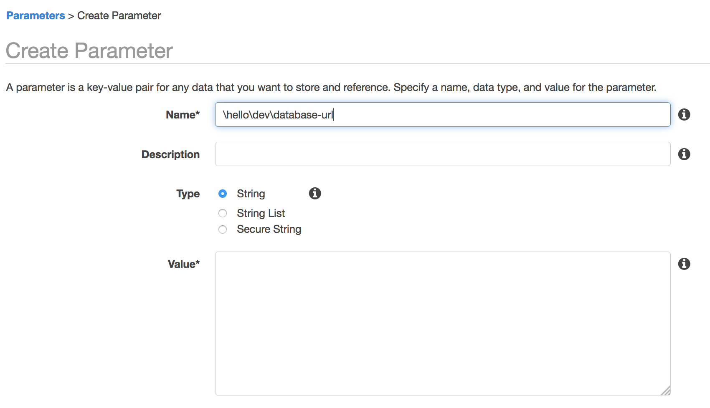
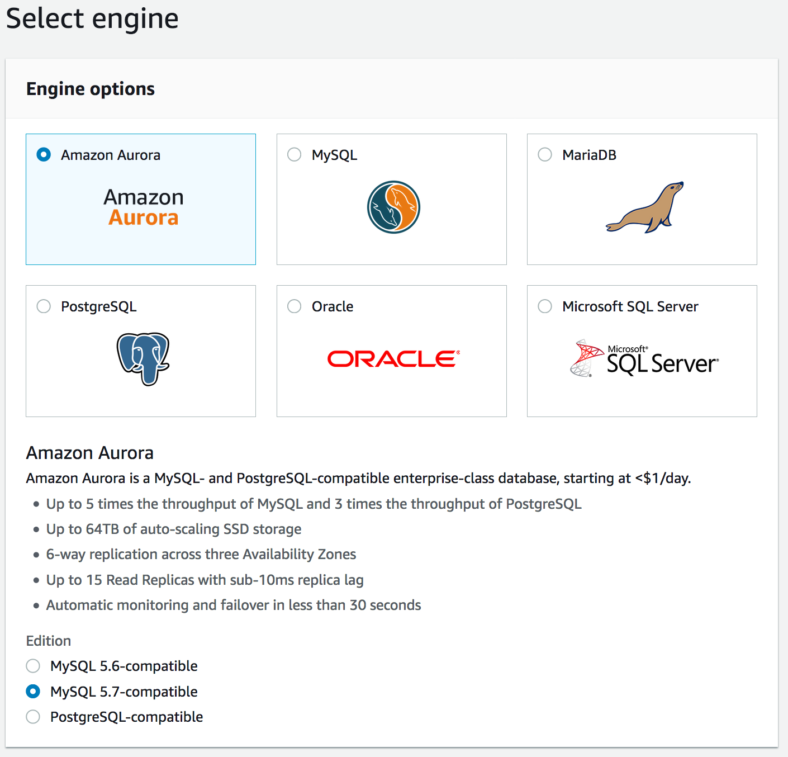
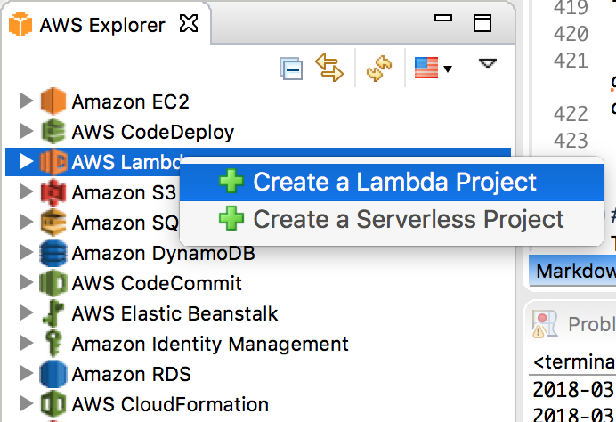
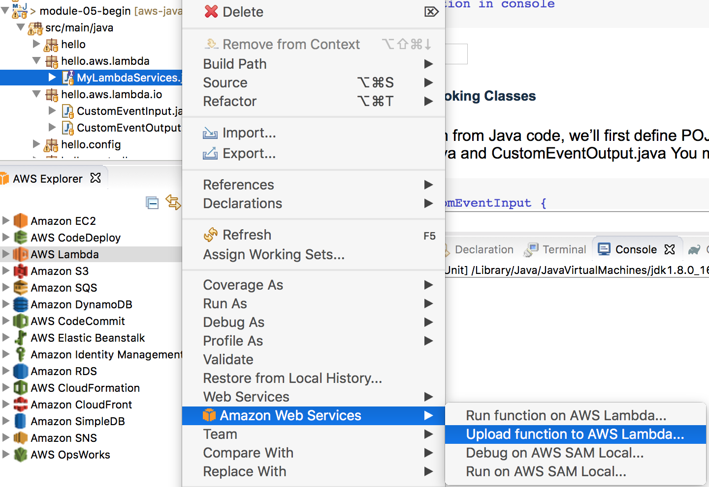

# Workshop for Java web application for AWS migration

<hr>

## 0. Preparation
##### 1. Install all required SDK, packages in your dev environment
- Java SDK 8, git client
- Eclipse Oxygen 2
- AWS plugin for Eclipse 
- AWS CLI in your development environment

The installation time generally takes 10~30mins. Attendees should to prepare all installations for their developing environment before starting this workshop.

<hr>

## 1. Module-01 :  Web application - Building a first web application with Spring Boot (time duration : 30 mins)
- This is a simple web application using Spring Boot and MySQL
- Check module-01 application and run this application to check the application structure and it's execution.

##### 1. Download source codes 
```
git clone https://github.com/aws-asean-builders/aws-java-spring-dev-workshop
```

##### 2. Configure environment.
- Setup MySQL and configure username/password
- install MySQL in your development environment, it depends on your dev OS, for example MacOs or Linux
- After installataion, create database and configure user name and password, for example (demouser/12345678)

```
## create database, user and it's privilege

mysql> create database workshop; -- Create the new database
mysql> create user 'demouser'@'localhost' identified by '12345678'; -- Creates the user
mysql> grant all on workshop.* to 'demouser'@'%'; -- Gives all the privileges to the new user on the newly created 


## crate User table

CREATE TABLE `User` (
  `id` integer NOT NULL AUTO_INCREMENT,
  `name` varchar(255) DEFAULT NULL,
  `email` varchar(255) DEFAULT NULL,
  PRIMARY KEY (`id`)
) ENGINE=InnoDB AUTO_INCREMENT=4 DEFAULT CHARSET=utf8 
```

##### 3. Check the structure of application
- Check **application.properties** and **spring.factories** in META-INF of resource folder. This file is for **CustomConfigListner.java** to change the environment configuration using Configuration Listner
- Check package structure, boot, controller, model, repository
- UserRepository is for the JPA 
- Check the **pom.xml**, it contains Spring Boot, JPA, MySQL, Thymeleaf

```
       <dependency>
            <groupId>org.springframework.boot</groupId>
            <artifactId>spring-boot-starter-data-jpa</artifactId>
        </dependency>    
        <dependency>
            <groupId>org.springframework.boot</groupId>
            <artifactId>spring-boot-starter-web</artifactId>
        </dependency>
        <dependency>
            <groupId>org.springframework.boot</groupId>
            <artifactId>spring-boot-starter-test</artifactId>
            <scope>test</scope>
        </dependency>
			  <!-- thymeleaf-->  
			  <dependency>
			    <groupId>org.springframework.boot</groupId>
			    <artifactId>spring-boot-starter-thymeleaf</artifactId>
			  </dependency>     
		    <dependency>
		      <groupId>org.webjars</groupId>
		      <artifactId>bootstrap</artifactId>
		      <version>3.3.7-1</version>
		    </dependency>			    		     
        <!-- Use MySQL Connector -->
        <dependency>
            <groupId>mysql</groupId>
            <artifactId>mysql-connector-java</artifactId>
        </dependency> 
 ```
##### 4. Run your test codes
Run MainControllerTest with JUnit Runner and check the console output and it's result. if you get a error messages then take a look at how to fix the problem.
We have 2 kinds of unit test, one is mock test, the other is integration test, please check 2 files in test folder.


##### 5. Test app using 'curl' for API
Launch your application in your Eclipse IDE and run 'curl' command like below

```
curl 'localhost:8080/workshop/deleteall'
curl 'localhost:8080/workshop/add?name=First&email=ex1@gmail.com'
curl 'localhost:8080/workshop/all'
```

##### 6. Run web page localhost:8080/index.html
- Run CRUD for User data
- see user list, add/update/delete user

##### Appedix. create a Spring Boot project from scratch
Please check this blog for creating a spring boot project from scratch using Maven. 
[add later]


<hr>

## Module-02 : First use of AWS service(Parameter Store) and it's integration (time duration : 40 mins)
- This module is creating CustomListner for retrieving environment parameters from Parameter Store in AWS System Manager. 
- There are many environment paramenters in Spring Data applications, for example, database connection URL, database user name, password or AWS access key and secret key, and there are described in application.properties, generally. the more secured way to retrieve these information is required. 
- Start from moudle-01 and complete the codes with below information.
- module-02 is a starting points to use AWS services with AWS Java SDK.
 
##### 1 add packages in pom.xml

```
    <dependencyManagement>
      <dependencies>
        <dependency>
          <groupId>com.amazonaws</groupId>
          <artifactId>aws-java-sdk-bom</artifactId>
          <version>1.11.289</version>
          <type>pom</type>
          <scope>import</scope>
        </dependency>
      </dependencies>
    </dependencyManagement>    
    
    <!-- AWS SDK System Manager -->  
    <dependency>
      <groupId>com.amazonaws</groupId>
      <artifactId>aws-java-sdk-ssm</artifactId>
    </dependency> 
    <dependency>
      <groupId>com.amazonaws</groupId>
      <artifactId>aws-java-sdk-s3</artifactId>
    </dependency>
    <dependency>
      <groupId>com.amazonaws</groupId>
      <artifactId>aws-java-sdk-dynamodb</artifactId>
    </dependency>
   
    
    <!-- AWS SDK rekognition -->  
		<dependency>
		  <groupId>com.amazonaws</groupId>
		  <artifactId>aws-java-sdk-rekognition</artifactId>
		</dependency>  
		<!-- AWS SDK translate -->  
		 <dependency>
		  <groupId>com.amazonaws</groupId>
		  <artifactId>aws-java-sdk-translate</artifactId>
		</dependency>            

```
##### 2. Configure AWS CLI to allow application to get access key and secret key
```
> aws configure
> AWS Access Key ID [None]: [your key]
> AWS Secret Access Key [None]: [your key]
```

##### 3. Configuration properties programmatically
- Create CustomConfigListner.java using following information 
- [spring boot application properites](https://stackoverflow.com/questions/29072628/how-to-override-spring-boot-application-properties-programmatically)
- [springboot prior to startup](https://stackoverflow.com/questions/33072452/log-configurationproperties-in-springboot-prior-to-startup)
	
- Create CustomConfigListner.java in hello package
- Create **src/main/resources/META-INF/spring.factories** and register above class in it

```
org.springframework.context.ApplicationListener=hello.CustomConfigListner
```

##### 4. Configure ParameterStore in System Manager 
AWS Systems Manager Parameter Store provides secure, hierarchical storage for configuration data management and secrets management. You can store data such as passwords, database strings, and license codes as parameter values.
Complete the following tasks to configure application parameters for ParameterStore (default region is us-east-1)

	1. Open the Amazon EC2 console at https://console.aws.amazon.com/ec2/
	2. Create parameters in ParameterStore for database URL, database username and password




##### 5. Check the availability of parameters in ParameterStore
- Run ParameterStoreTest.java 


##### 6. Modify CustomConfigListner.java 
- Integrate with your parameters in System Manager.
- Add additional parameters you need in your application


##### 7. Check features using unit tests
- Modify Test classes
- Run CustomConfigTest

##### 8. For next implementation
- Please check classes in hello.logics and unit test in hello.logics

<hr>

## Module 3 : Using AWS services (time duration : 30 mins)
From this module, we are beginning to develop application using AWS services.
We will complete the following tasks.
- Resize a file and save it to local folder
- Upload a file to S3 using AWS SDK
- Retrieve information from picture using Amazon Rekognition and Translate text using Amazon Translate
- Change database from Mysql to Aurora for Mysql 
- Store a file meta data to DynamoDB

**Start from the module-02**

#### 1. references
Please refer the following information to complete the tasks
 
[Develop S3](https://docs.aws.amazon.com/sdk-for-java/v1/developer-guide/examples-s3-objects.html#upload-object)

[Develop Rekognition](https://docs.aws.amazon.com/rekognition/latest/dg/get-started-exercise.html)

[Develop Translate](https://docs.aws.amazon.com/translate/latest/dg/examples-java.html)

#### 2. Basic structure to use AWS services
	1. Declare a client for the services to call
	2. Initialzie a client with various information

for example

```

AmazonTranslate translate = AmazonTranslateClientBuilder
							.standard()
							.withRegion(region)   // set region
							.withCredentials(new AWSStaticCredentialsProvider(credentials)) //set credentials
							.build();

```

##### 3. Implement logics
- Check AWSAIServicesTest and complete AWSAIServices.java, S3FileTransfer.java based on Unit Test
- Create S3 file transferring and translate 

##### 4. Implement DynamoDB 
- Check DynamoDBTest
- Complete the tasks to implement the DDB logics in Unit Test (not logics)

#### 5. Change the database from local MySQL to Aurora MySQL

	1. Open the Amazon RDS console : https://console.aws.amazon.com/rds/home?region=us-east-1#
	2. Select Aurora for MySQL 5.7 Database engine 
	3. Create a DB instance configuring databasename, username, password.
	


	4. Wait until Aurora for MySQL launching
	5. Change parameter values in Parameter Store in EC2 to Aurora instance

<hr>

## Module-04 : Using multiple repositories using Spring Data (time durations : 30 mins)
In this module, we will learn how to configure the multiple repositories of Aurora and DynamoDB using Spring Data.
- Create configuration files for DynamoDB and MySQL DB. 
- Create Model classes for each database (User for MySQL, PhotoInfo for DynamoDB)
- Create a model, repository packages and change Model and Repository package path to distinguish it in two repositories 
- Change application.properties
- Test 2 repositories with Unit Test codes

##### 1. Add Spring Data for Database
We arg going to use Spring Data for DynamoDB 

reference : [derjust's Github](https://github.com/derjust/spring-data-dynamodb)

Add it to Pom.xml

```
    <!-- spring-data-dynamo-db -->
    <dependency>
        <groupId>com.github.derjust</groupId>
        <artifactId>spring-data-dynamodb</artifactId>
        <version>4.5.0</version>
    </dependency> 
		    
```

##### 2. Implement DB configuration classes
reference : [dynamodb put item request](https://github.com/aws-samples/aws-dynamodb-examples/blob/master/src/main/java/com/amazonaws/codesamples/lowlevel/LowLevelItemCRUDExample.java)

We need to create configuration class for MySQL and DynamoDB to use each repository
Here is MysqlDBConfig example.

```
@Configuration
@EnableTransactionManagement
@EnableJpaRepositories(
		entityManagerFactoryRef = "mysqlEntityManager", 
		transactionManagerRef = "mysqlTransactionManager", 
		basePackages = "hello.repository.mysql"
)
public class MysqlDBConfig {
	
	@Autowired
	public ConfigurableEnvironment environment;
	
	/**
	 * MySQL datasource definition.
	 * 
	 * @return datasource.
	 */
	@Bean
	@ConfigurationProperties(prefix = "spring.mysql.datasource")
	public DataSource mysqlDataSource() {
		System.out.println("##### DataSource called");
		DataSource ds = DataSourceBuilder.create().build();
		System.out.println("##### DataSource url = " + environment.getProperty("spring.mysql.datasource.url").toString());
		return ds ;
	}
 
	/**
	 * Entity manager definition. 
	 *  
	 * @param builder an EntityManagerFactoryBuilder.
	 * @return LocalContainerEntityManagerFactoryBean.
	 */
	@Bean(name = "mysqlEntityManager")
	public LocalContainerEntityManagerFactoryBean mysqlEntityManagerFactory(EntityManagerFactoryBuilder builder) {
		return builder
					.dataSource(mysqlDataSource())
					.properties(hibernateProperties())
					.packages(User.class)
					.persistenceUnit("mysqlPU")
					.build();
	}
 
	/**
	 * @param entityManagerFactory
	 * @return
	 */
	@Bean(name = "mysqlTransactionManager")
	public PlatformTransactionManager mysqlTransactionManager(@Qualifier("mysqlEntityManager") EntityManagerFactory entityManagerFactory) {
		return new JpaTransactionManager(entityManagerFactory);
	}
 
	private Map<String, Object> hibernateProperties() {
 
		Resource resource = new ClassPathResource("hibernate.properties");
		try {
			Properties properties = PropertiesLoaderUtils.loadProperties(resource);
			return properties.entrySet().stream()
											.collect(Collectors.toMap(
														e -> e.getKey().toString(),
														e -> e.getValue())
													);
		} catch (IOException e) {
			return new HashMap<String, Object>();
		}
	}

```
Change **spring.datasource** properties to **spring.mysql.datasource** in CustomConfigListner.java

```
    ConfigurableEnvironment environment = event.getEnvironment();
    Properties props = new Properties();
    props.put("spring.mysql.jpa.hibernate.ddl-auto", "update");
    props.put("spring.mysql.datasource.url", url);
    props.put("spring.mysql.datasource.username", username);
    props.put("spring.mysql.datasource.password", password);
    props.put("spring.mysql.datasource.driver-class-name", "com.mysql.jdbc.Driver");
    environment.getPropertySources().addFirst(new PropertiesPropertySource("myProps", props));

```
These new application properties will be used in this module.

##### 3 Separate Model classes into different package.
hello.model.mysql.User
hello.model.ddb.PhotoInfo

##### 4. Create a test code
Create PhotoInfoTest in hello.repository(test)

```
  @Autowired
  PhotoInfoRepository repository;
  
  @Test
  public void sampleTestCase() {
	  repository.deleteAll();
	  PhotoInfo p = new PhotoInfo("a.jpeg", "hello", "hallo");	
	  repository.save(p);
    
    List<PhotoInfo> result2 = (List<PhotoInfo>) repository.findAll(); 
    
    assertTrue("Not empty", result2.size() > 0);
  }
```

<hr>

##  Module-05 : Change Logics to Lambda (time durations : 40 mins)  
This module requires a knowledge session for StepFunction service.
Start from module-05-begin

##### reference
[Invoking AWS Lambda Functions from Java](https://aws.amazon.com/blogs/developer/invoking-aws-lambda-functions-from-java/)


##### 1. Create a first Lambda project
Create a Lambda project using AWS Eclipse plugin
	
	1. Open AWS Explorer in your Eclipse
	2. Right click on AWS Lambda and create a new Lambda Project "module-05-lambda-custom"
	3. Select "Custom Event" and create a project



	4. Before uploading a Lambda function, you need to create a Role for your Lambda Function.
	5. Upload function to "US-EAST-1" name as "My-Custom-Function" (choose a Role created step 4)
	6. Test this function in console 
	


##### 2. Create a Lambda Invoking Classes
To invoke this function from Java code, we’ll first define POJOs representing the input and output JSON
CustomEventInput.java and CustomEventOutput.java
You must implement a constructor in CustomEventOutput

```
public class CustomEventInput {
    private List<Integer> values;
    public List<Integer> getValues() {
        return values;
    }
    public void setValues(List<Integer> values) {
        this.values = values;
    }
}

public class CustomEventOutput {
	public CustomEventOutput()  // must 
	{}
    private Integer value;
    public CustomEventOutput(int value) {
        setValue(value);
    }
    public Integer getValue() {
        return value;
    }
    public void setValue(Integer value) {
        this.value = value;
    }
    
```
##### 3. Define Lamdba Invoking service interface
Define an interface representing our microservice, and annotate it with the name of the Lambda function to invoke when it’s called

```
public interface MyLambdaServices {
	@LambdaFunction(functionName="MyCustomFunc")
	CustomEventOutput myCustumFunc(CustomEventInput input);
}
```
##### 4. Create Unit test code
We invoke our service using this unit test code;

```
	@Test
	public void callCustomLamdba()
	{
    
    final MyLambdaServices myService = LambdaInvokerFactory.builder()
    		 .lambdaClient(AWSLambdaClientBuilder.defaultClient())
    		 .build(MyLambdaServices.class);
    
    CustomEventInput input = new CustomEventInput();
    List<Integer> list = new ArrayList();
    list.add(1);
  		list.add(5);
  		input.setValues(list);

    CustomEventOutput output = myService.myCustumFunc(input);  
    assertEquals((int)output.getValue(), (int)5);
    
	}

```

### 2. implement 3 lambda functions.
- retrieve information from images
- translate text
- save text to DDB

 reference for Lambda 


## module-06 : Create StepFunction and use a stepfucntion in your application
This module requires a knowledge session for StepFunction service.
 
### 1. Create a StepFunction using CloudFormation
#### 1.1 reference for StepFunction
https://docs.aws.amazon.com/step-functions/latest/dg/tutorial-lambda-state-machine-cloudformation.html

### 2. Create a service logic to call a StepFunction.
ref: https://aws.amazon.com/blogs/developer/stepfunctions-fluent-api/


## Module-07 Add X-Ray
ref : https://docs.aws.amazon.com/xray/latest/devguide/xray-sdk-java.html

### 1. Setup X-Ray daemon for local and server
ref : https://docs.aws.amazon.com/xray/latest/devguide/xray-daemon.html
The AWS X-Ray daemon is a software application that listens for traffic on UDP port 2000, gathers raw segment data, and relays it to the AWS X-Ray API. The daemon works in conjunction with the AWS X-Ray SDKs and must be running so that data sent by the SDKs can reach the X-Ray service. 

#### 1.1 download daemon 
#### 1.2 run daemon
/xray_mac -o -n us-east-1 & (for example)
#### 1.3 check the 

#### 2.add packages in pom.xml
x-ray packages

#### add code
1. configuraiton file
2. SQL
3. add segment to CustomConfigListner
4. add code to Client
5. check X-Ray using Unit Test.


## Module-08 Create a docker and CI/CD for first Deployment on AWS


## Module-08 DevSecsOps

## Module-09 Custom Metrics and CloudWath Logs for data analytics


### Spring Cloud
https://cloud.spring.io/spring-cloud-aws/
Now Spring Cloud support S3, SNS, SQS, ElastiCache,CloudFormation and RDS

## git examples

git tag -l v1.1.*

git tag v1.0.2

git push origin v1.0.3

git clone

git checkout tags/<tag_name> 

git checkout tags/<tag_name> -b <branch_name>

delete tags

git push --delete origin <tag_name>

git tag --delete <tag_name>


## blog
1. Configuration - parameter store connection
2, Repository - Spring data