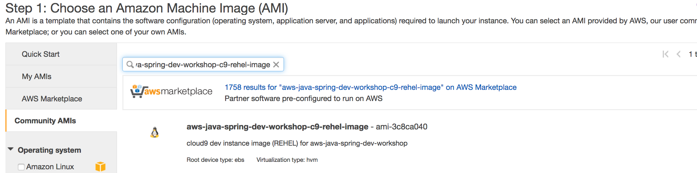
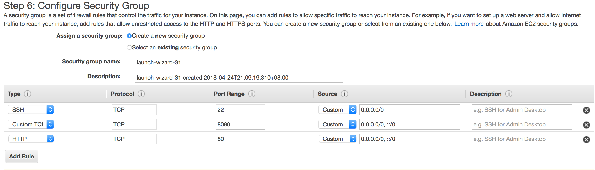
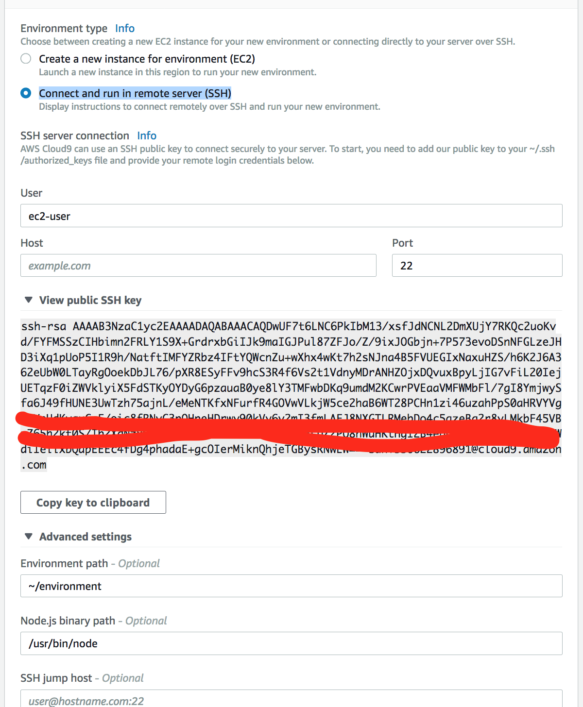
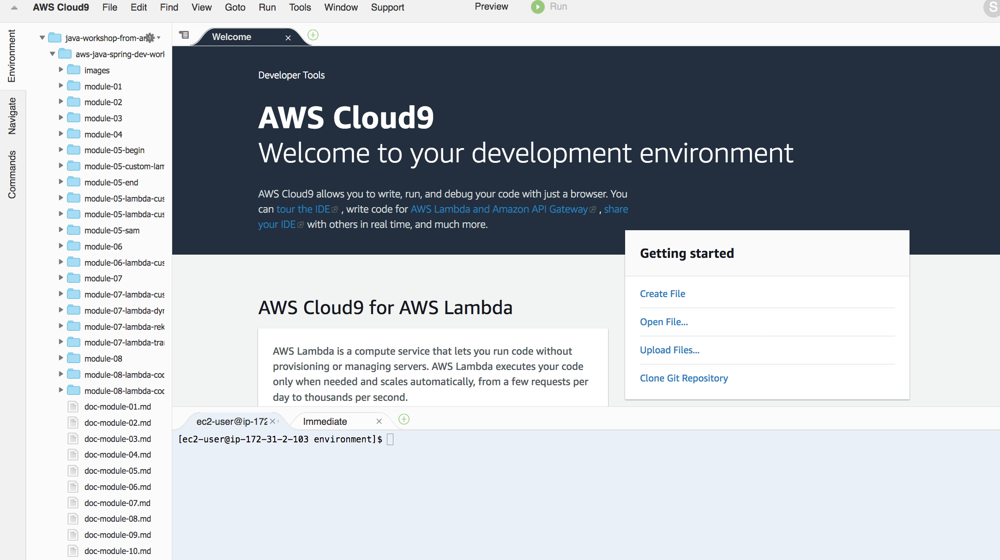

## Configuring Dev Environment : (time duration : 30 ~ 40 mins)
- This module is for configuring your dev environment
- We will show the two kind of dev environment, one is Eclipse, the other is Cloud9.
- Eclipse IDE is recommended as your dev IDE for studying this workshop


### 1. Eclipse IDE (recommendation)

#### 1.1 Install all required SDK, packages in your dev environment
###### Mandatory
- Java SDK 8
- Git client, 
- Maven (3.5.3)
- Eclipse Oxygen 3
- AWS plugin for Eclipse  : https://docs.aws.amazon.com/toolkit-for-eclipse/v1/user-guide/setup-install.html

- AWS CLI in your development environment : https://docs.aws.amazon.com/cli/latest/userguide/installing.html
- Create on EC2 Role and Lambda Role with admin access privilege.

###### Optional
- Install TM Terminal, Eclipse plugin (http://download.eclipse.org/releases/neon)
- Install YAML editor, Eclipse plugin
- Install MySQL (Please see below appendix)

**The installation generally takes 10 ~ 30mins. Attendees should prepare all installations for their developing environment before starting this workshop.**

#### 1.2 Check your configuration

Run following commands and check each package is available

```
java -version
git
aws
mvn
```

<hr>

### 2. Using Cloud9 (alternative) 


#### 2.1. Create your Cloud9 environments
Before starting, you need to configure **your EC2 role** for Cloud9 environment instance.

##### 1. launch your instance 

	1. Search "aws-java-spring-dev-workshop-rehel-dev-1.0" 



	2. Select "Red Hat Enterprise Linux 7.5 (HVM), SSD Volume Type" in Singapore Region	
	3. Specify launch setup 
	   Enable public IP
	   Create a new IAM role  -> You need to change a role to have a privilege to access AWS services later
	4. Configure Security Group
	
	
	5. Wait for launching	
	
##### 2. Create a Cloud9 
	1. Create new environemt
	2. Select "Connect and run in remote server (SSH)"
	3. Specify all parameters
	
	
	4. Copy public SSH key 
	5.	 Paste it to ~/.ssh/authorized_keys
	
```
ls -al ~/.ssh/authorized_keys 
-rw-------. 1 ec2-user ec2-user 1157 Apr 24 13:16 /home/ec2-user/.ssh/authorized_keys	

```
	6. Create environment
	7. Open IDE
	


#### 2.2 Check dev environemt
- Download source codes and run module-01


```
	cd ~/environment
	git clone https://github.com/aws-asean-builders/aws-java-spring-dev-workshop
	cd aws-java-spring-dev-workshop/module-01

	mvn -f pom.xml compile
	mvn -f pom.xml package
	
	### you can skip the test
	mvn -f pom.xml package -Dmaven.test.skip=true

```

<hr>


### 3 Detail Configuration (referencing only)
- This instruction only covers Linux (Redhat or CentOS) installation. you need to find a way to set up according to your environment


#### 3.1 Install all SDK and packages

##### 1. Install Java SDK
	1. Check java --version and check the location of Java 
```
$ java -version
java version "1.7.0_171"

$ which java
/usr/bin/java

```
	
	2. Upgrade java version to 1.8 (for development, we need to upgrade Java version and install required packages)
	
```
sudo yum list available java\*      # check available java version
sudo yum -y install java-1.8.0 java-1.8.0-openjdk-devel        # install 1.8 java and javac
sudo yum remove java-1.7.0-openjdk -y # remove 1.7
java -version											# check java version
```

	3. Update JAVA_HOME environment variable in .bashrc

```
vi ~/.bashrc
### add follwing content
export JAVA_HOME=/usr/
```
	
##### 2. Install Maven

```
$ cd /usr/local
$ sudo wget http://www-eu.apache.org/dist/maven/maven-3/3.5.3/binaries/apache-maven-3.5.3-bin.tar.gz
$ sudo tar xzf apache-maven-3.5.3-bin.tar.gz
$ sudo ln -s apache-maven-3.5.3  maven

$ sudo vi /etc/profile.d/maven.sh

# add following content.
export M2_HOME=/usr/local/maven
export PATH=${M2_HOME}/bin:${PATH}

# load the environment variables in current shell using following command.
source /etc/profile.d/maven.sh

# check the loaded environment variables  
echo $PATH             
```

##### 3. Install nodejs (optional)
https://tecadmin.net/install-latest-nodejs-and-npm-on-centos/

```
sudo yum install -y gcc-c++ make
curl -sL https://rpm.nodesource.com/setup_8.x | sudo -E bash -

# install node and npm
sudo yum install nodejs

# check version
node -v 

```

### 3.2 MySQL installation
- MySQL 5.6 is recommended.

	1. install MySql

refer : https://www.digitalocean.com/community/tutorials/how-to-install-mysql-on-centos-7

```
	# msql 5.6
	rpm -ivh http://dev.mysql.com/get/mysql-community-release-el6-5.noarch.rpm
	sudo rpm -ivh mysql-community-release-el6-5.noarch.rpm

	sudo yum install mysql-server

	#start server
	sudo service mysqld start
	
	# grep a temp password
	sudo grep 'temporary password' /var/log/mysqld.log
	
	#set root password
	mysql_secure_installation
	
	# connet as root user with temp password
	mysql -uroot -p
	
	ALTER USER 'root'@'localhost' IDENTIFIED BY 'Work@123!';
	
	# create a database
	create database workshop;
	
```
	
	2. Create user and it's privilege using following SQL commands(use MySQL client in your computer)

```
mysql> CREATE USER 'demouser'@'%' identified by '12345678';; -- Creates the user
mysql> GRANT ALL ON *.* TO 'demouser'@'%' IDENTIFIED BY '12345678';; -- Gives all the privileges to the new user on the newly created 
mysql> FLUSH PRIVILEGES;


```

	4. Create User table 

```
USE workshop;

CREATE TABLE `User` (
  `id` integer NOT NULL AUTO_INCREMENT,
  `name` varchar(255) DEFAULT NULL,
  `email` varchar(255) DEFAULT NULL,
  PRIMARY KEY (`id`)
) ENGINE=InnoDB AUTO_INCREMENT=4 DEFAULT CHARSET=utf8;

```

	5. Check the table created

```
show tables;

describe User;
```


