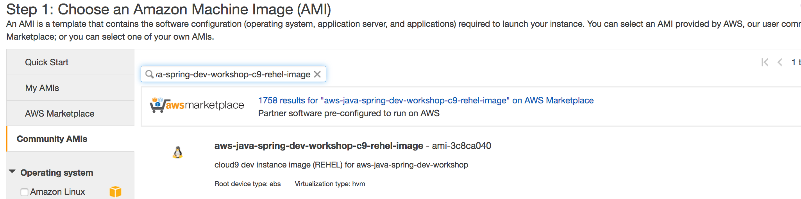

## 1. Module-01 :  Web application - Building a first web application with Spring Boot (time duration : 30 mins)
- This is a simple web application using Spring Boot and MySQL
- Check module-01 application and run this application to check the application structure and it's execution.

### 0. Create your Cloud9 IDE environment 

#### 0.0 Configure your dev environment (skip this, it is only for creating the first environment for EC2 instance)

	1. Select EC2 ReHel as dev instance
	1.1 Launch your EC2 instance in Virginia(us-east-1) or Singapore region (ap-southeast-1) based on REHEL image

install MySQL (you can skip this step)

	2. install MySql

refer : https://www.digitalocean.com/community/tutorials/how-to-install-mysql-on-centos-7

```
	# msql 5.6
	rpm -ivh http://dev.mysql.com/get/mysql-community-release-el6-5.noarch.rpm
	sudo rpm -ivh mysql-community-release-el6-5.noarch.rpm

	sudo yum install mysql-server

	#start server
	sudo service mysqld start
	
	# grep a temp password
	sudo grep 'temporary password' /var/log/mysqld.log
	
	#set root password
	mysql_secure_installation
	
	# connet as root user with temp password
	mysql -uroot -p
	
	ALTER USER 'root'@'localhost' IDENTIFIED BY 'Work@123!';
	
	# create a database
	create database workshop;
	
```
	
	3. Create user and it's privilege using following SQL commands(use MySQL client in your computer)

```
mysql> CREATE USER 'demouser'@'%' identified by '12345678';; -- Creates the user
mysql> GRANT ALL ON *.* TO 'demouser'@'%' IDENTIFIED BY '12345678';; -- Gives all the privileges to the new user on the newly created 
mysql> FLUSH PRIVILEGES;


```

	4. Create User table 

```
USE workshop;

CREATE TABLE `User` (
  `id` integer NOT NULL AUTO_INCREMENT,
  `name` varchar(255) DEFAULT NULL,
  `email` varchar(255) DEFAULT NULL,
  PRIMARY KEY (`id`)
) ENGINE=InnoDB AUTO_INCREMENT=4 DEFAULT CHARSET=utf8;

```

	5. Check the table created

```
show tables;

describe User;
```


##### 2. Upgrade a dev instance
	1. Check java --version and check the location of Java 
```
$ java -version
java version "1.7.0_171"

$ which java
/usr/bin/java

```
	
	2. Upgrade java version to 1.8 (for development, we need to upgrade Java version and install required packages)
	
```
sudo yum list available java\*      # check available java version
sudo yum -y install java-1.8.0 java-1.8.0-openjdk-devel        # install 1.8 java and javac
sudo yum remove java-1.7.0-openjdk -y # remove 1.7
java -version											# check java version
```

	3. Update JAVA_HOME environment variable in .bashrc

```
vi ~/.bashrc
### add follwing content
export JAVA_HOME=/usr/
```
	
	4. Install Maven

```
$ cd /usr/local
$ sudo wget http://www-eu.apache.org/dist/maven/maven-3/3.5.3/binaries/apache-maven-3.5.3-bin.tar.gz
$ sudo tar xzf apache-maven-3.5.3-bin.tar.gz
$ sudo ln -s apache-maven-3.5.3  maven

$ sudo vi /etc/profile.d/maven.sh

# add following content.
export M2_HOME=/usr/local/maven
export PATH=${M2_HOME}/bin:${PATH}

# load the environment variables in current shell using following command.
source /etc/profile.d/maven.sh

# check the loaded environment variables  
echo $PATH             
```

##### 4. Check the result of previous step 
	1. Run following command to check no erros (in terminals in your code)

```	
	cd <your_source folder>

	mvn -f pom.xml compile
	mvn -f pom.xml package
	
	### you can skip the test
	mvn -f pom.xml package -Dmaven.test.skip=true
```


##### 3. install nodejs
https://tecadmin.net/install-latest-nodejs-and-npm-on-centos/

```
sudo yum install -y gcc-c++ make
curl -sL https://rpm.nodesource.com/setup_8.x | sudo -E bash -

# install node and npm
sudo yum install nodejs

# check version
node -v 

```

#### 0.1. Create your Cloud9 environments

##### 1. launch your instance 

	1. Search "aws-java-spring-dev-workshop-c9-rehel-image" 



	2. Select "Red Hat Enterprise Linux 7.5 (HVM), SSD Volume Type" in Singapore Region	
	3. Specify launch setup 
	   Enable public IP
	   Create a new IAM role  -> You need to change a role to have a privilege to access AWS services later
	4. Configure Security Group
	
	
	5. Wait for launching	
	
##### 2. Create a Cloud9 
	1. Create new environemt
	2. Select "Connect and run in remote server (SSH)"
	3. Specify all parameters
	
	
	4. Copy public SSH key 
	5.	 Paste it to ~/.ssh/authorized_keys
```	
ls -al ~/.ssh/authorized_keys 
-rw-------. 1 ec2-user ec2-user 1157 Apr 24 13:16 /home/ec2-user/.ssh/authorized_keys	
```	

	6. Create environment
	7. Open IDE
	


	

<hr>

### 1. Run your first Java application

##### 1. Download source codes 
```
git clone https://github.com/aws-asean-builders/aws-java-spring-dev-workshop
```

##### 2. Configure environment.
- Setup MySQL and configure username/password
- install MySQL in your development environment, it depends on your dev OS, for example MacOs or Linux
- After installataion, create database and configure user name and password, for example (demouser/12345678)

```
## create database, user and it's privilege

mysql> create database workshop; -- Create the new database
mysql> create user 'demouser'@'localhost' identified by '12345678'; -- Creates the user
mysql> grant all on workshop.* to 'demouser'@'%'; -- Gives all the privileges to the new user on the newly created 


## crate User table

CREATE TABLE `User` (
  `id` integer NOT NULL AUTO_INCREMENT,
  `name` varchar(255) DEFAULT NULL,
  `email` varchar(255) DEFAULT NULL,
  PRIMARY KEY (`id`)
) ENGINE=InnoDB AUTO_INCREMENT=4 DEFAULT CHARSET=utf8 
```

##### 3. Check the structure of application
- Check **application.properties** and **spring.factories** in META-INF of resource folder. This file is for **CustomConfigListner.java** to change the environment configuration using Configuration Listner
- Check package structure, boot, controller, model, repository
- UserRepository is for the JPA 
- Check the **pom.xml**, it contains Spring Boot, JPA, MySQL, Thymeleaf

```
  <dependency>
    <groupId>org.springframework.boot</groupId>
    <artifactId>spring-boot-starter-data-jpa</artifactId>
  </dependency>    
  <dependency>
    <groupId>org.springframework.boot</groupId>
    <artifactId>spring-boot-starter-web</artifactId>
  </dependency>
  <dependency>
    <groupId>org.springframework.boot</groupId>
    <artifactId>spring-boot-starter-test</artifactId>
    <scope>test</scope>
  </dependency>
  <!-- thymeleaf-->  
  <dependency>
    <groupId>org.springframework.boot</groupId>
    <artifactId>spring-boot-starter-thymeleaf</artifactId>
  </dependency>     
  <dependency>
    <groupId>org.webjars</groupId>
    <artifactId>bootstrap</artifactId>
    <version>3.3.7-1</version>
  </dependency>			    		     
  <!-- Use MySQL Connector -->
  <dependency>
    <groupId>mysql</groupId>
    <artifactId>mysql-connector-java</artifactId>
  </dependency> 
 ```
##### 4. Run your test codes
Run MainControllerTest with JUnit Runner and check the console output and it's result. if you get a error messages then take a look at how to fix the problem.
We have 2 kinds of unit test, one is mock test, the other is integration test, please check 2 files in test folder.


##### 5. Test app using 'curl' for API
Launch your application in your Eclipse IDE and run 'curl' command like below

```
curl 'localhost:8080/workshop/deleteall'
curl 'localhost:8080/workshop/add?name=First&email=ex1@gmail.com'
curl 'localhost:8080/workshop/all'
```

##### 6. Run web page localhost:8080/index.html
- Run CRUD for User data
- see user list, add/update/delete user

##### Appedix. create a Spring Boot project from scratch
Please check this blog for creating a spring boot project from scratch using Maven. 
[add later]

##### run maven
```
mvn package && java -jar target/module-01-0.1.0.jar
```
for test

```
mvn clean comple test
```

without unit test

```
mvn package -Dmaven.test.skip=true
```

if you get a error related to "JABXExeption", then add following content in your pom.xml

```
<!-- add JAX-B to prevent No Class Found : JABXExeption -->
<dependency>
    <groupId>javax.xml.bind</groupId>
    <artifactId>jaxb-api</artifactId>
    <version>2.2.11</version>
</dependency>
<dependency>
    <groupId>com.sun.xml.bind</groupId>
    <artifactId>jaxb-core</artifactId>
    <version>2.2.11</version>
</dependency>
<dependency>
    <groupId>com.sun.xml.bind</groupId>
    <artifactId>jaxb-impl</artifactId>
    <version>2.2.11</version>
</dependency>    		
```			 
