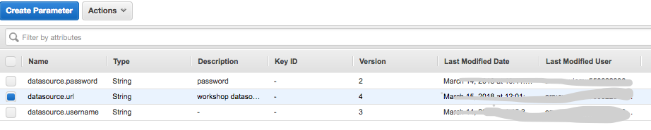

## Module 3 : Using AWS services (time duration : 30 mins)
From this module, we are beginning to develop application using AWS services.
We will complete the following tasks.
- Change database from Mysql to Aurora for Mysql 
- Resize a file and save it to local folder
- Upload a file to S3 using AWS SDK
- Retrieve information from picture using Amazon Rekognition and Translate text using Amazon Translate
- Store a file meta data to DynamoDB

**Start from the module-02**

### 1. references
Please refer the following information to complete the tasks
[Develop S3](https://docs.aws.amazon.com/sdk-for-java/v1/developer-guide/examples-s3-objects.html#upload-object)
[Develop Rekognition](https://docs.aws.amazon.com/rekognition/latest/dg/get-started-exercise.html)
[Develop Translate](https://docs.aws.amazon.com/translate/latest/dg/examples-java.html)


### 2. Change database to Aurora for MySql 

#### 2.1. Create Aurora MySQL

	1. Open the Amazon RDS console : https://console.aws.amazon.com/rds/home?region=us-east-1#
	2. Select Aurora for MySQL 5.7 Database engine and select the 
	3. Create a DB instance configuring database name, username, password.
	4. Remember your master username and password to perform next step
	


	5. Create database in configuration page (for example, workshop)
	
Name your Aurora database as TSA-Workshop, and keep the rest of the values as default.
- Select db instances of your choice (e.g. db.t2.micro)
- Keep the default multi-AZ
- Cluster name: TSA-Workshop-Cluster
- Database name: workshop
- Make sure that the database is publicly accessible.
- Keep everything else as default and then launch the Aurora database.
- At your left panel, click on the 'instances' menu. You should see that RDS is creating two database instances for you (one reader and writer role respectively).
	
	6. Wait until completing the creation of Aurora for MySQL 
Endpoint looks like this - "tsa-workshop.ctdltt3xxxx.us-east-1.rds.amazonaws.com"
	
	7. Check Endpoint and Security Group

	
	8. Change Security Group configuration, if you need.
	9. Check connectivity from your local computer (if you don't have any MySQL client, please install it)
	
```
brew install mysql

mysql -h <endpoint of your instance> -u <master username> -p
```
	
	10. Create user and it's privilege using following SQL commands(use MySQL client in your computer)

```
mysql> create user 'demouser'@'%' identified by '12345678'; -- Creates the user
mysql> grant all on workshop.* to 'demouser'@'%'; -- Gives all the privileges to the new user on the newly created 
```

	12. Check the tables, there is no table yet.

```
show tables;

```
	13. You can use GUI tool for MySQL (for example, DBVisualizer)
	
	


#### 2.2. Configure ParameterStore in System Manager 

AWS Systems Manager Parameter Store provides secure, hierarchical storage for configuration data management and secrets management. You can store data such as passwords, database strings, and license codes as parameter values.
Complete the following tasks to configure application parameters for ParameterStore (default region is us-east-1)

	1. Open the Amazon EC2 console at https://console.aws.amazon.com/ec2/
	2. Change values in ParameterStore for database URL, database username and password
		datasource.url = jdbc:mysql://<your_db_endpoint>/workshop?&useSSL=false
		datasource.username = demouser
		datasource.password = 12345678
	
	


	3. Add datasource.url, datasource.username, datasource.password for your Aurora instance. 
	   Specify values as you configured in previous steps.
	



#### 2.3 Run your application (Not changed Yet)
After running, check tables of workshop database 

```
user workshop;

show tables;

select * from User;

```

### 3. Implement logics

#### 3.1 Basic structure to use AWS services
	1. Declare a client for the services to call
	2. Initialize a client with various information

for example

```

AmazonTranslate translate = AmazonTranslateClientBuilder
							.standard()
							.withRegion(region)   // set region
							.withCredentials(new AWSStaticCredentialsProvider(credentials)) //set credentials
							.build();

```

#### 3.2 Complete a logics

1. create package "hello.logics"


- Check AWSAIServicesTest and complete AWSAIServices.java, S3FileTransfer.java based on Unit Test
- Create S3 file transferring and translate 


#### 6. Test a service
Test a IntegratedTransTest.java and Implement a IntegratedTrans.java
