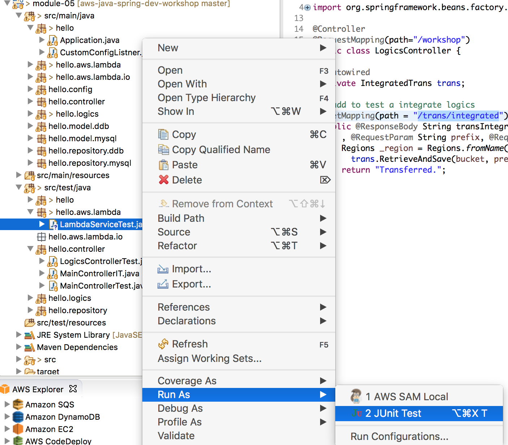
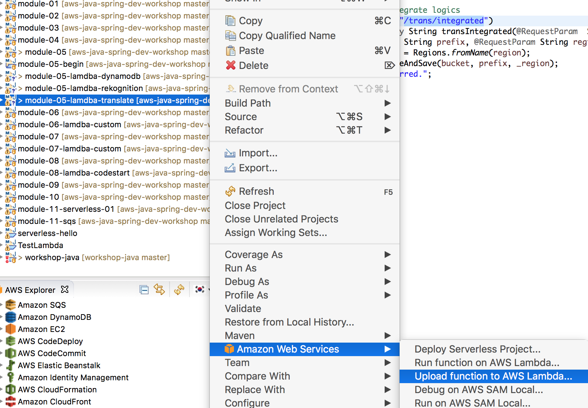
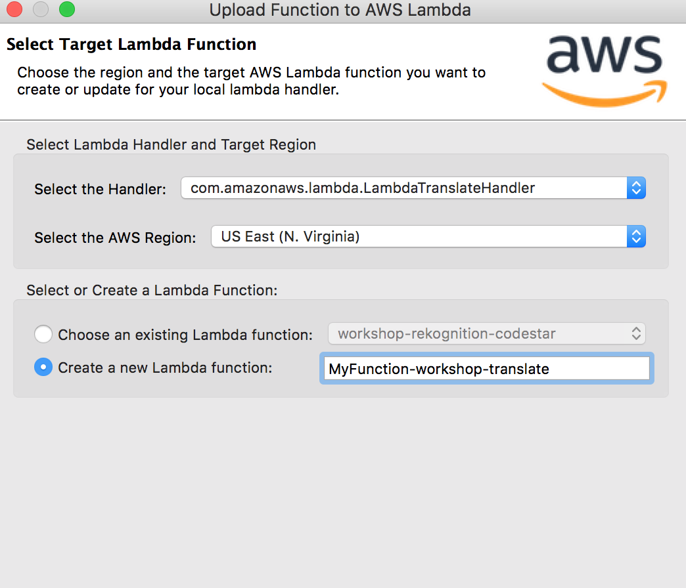
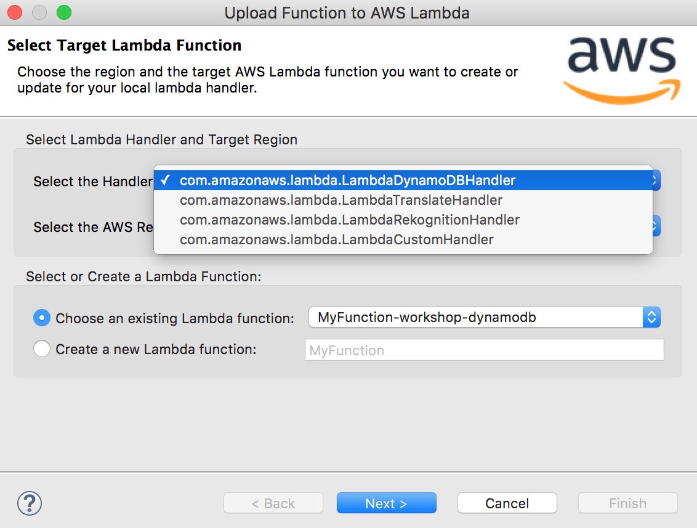

##  Module-05 : Change Logics to Lambda (time durations : 40 mins) 
In this module, we will cover how to create Lambda project using AWS plugin and add custom event for it.
 
- Create a Lambda project using AWS plugin for Eclipse
- Create a custom event for Lambda and Lambda invocation service interface
- Create a 3 Lambda project to replace the application logics

##### reference
[Invoking AWS Lambda Functions from Java](https://aws.amazon.com/blogs/developer/invoking-aws-lambda-functions-from-java/)

## If you start from module-05 (from completed source code)

### 1. Run application

```
mvn compile package -Dmaven.test.skip=true

java -jar target/module-05-0.1.0.jar

```

### 2. Run unit Test and Curl

### 2.1 Run LambdaServiceTest.java in **hello.aws.lambda in src/testjava**



### 2.2 Curl
- bucket=your bucket name
- prefix= your file prexix (for exmple, images/a.jpg)
- region = your region

```
curl 'localhost:8080/workshop/trans/integrated?bucket=<your_bucket>&prefix=<prefix>&region=<region>'
```


- **You definitely got error above 2.1 and 2.2, it is because you don't have Lambda functions**
- You need to create this following step 2

### 3. Upload 3 Lambda Services

- Upload 3 lambda functions using module-05-lambda-dymanodb, module-05-lambda-rekognition, module-05-lambda-translate

module-07-lambda-dymanodb : MyFunction-workshop-dynamodb
module-07-lambda-rekognition :MyFunction-workshop-rekognition
module-07-lambda-translate : MyFunction-workshop-translate


#### 3.1. Upload 3 translate 

	1. Right Click and select Upload Lamdba




	2. Specify a name as "MyFunction-workshop-translate"



	3. Specify Role, and S3 bucket.
**If you don't have a role for Lambda then, create it first**


#### 3.2 Repeat above step for MyFunction-workshop-dynamodb and MyFunction-workshop-rekognition


#### 3.3 Rerun 2.1 and 2.2


<hr>
<hr>
<hr>

## If you start from previous module (not completed source code)
<hr>

### 1. Create a first Lambda project

#### 1.1. Create a Lambda project using AWS Eclipse plugin
	
	1. Open AWS Explorer in your Eclipse
	2. Right click on AWS Lambda and create a new Lambda Project "module-05-lambda-custom"
	3. Select "Custom Event" and create a project


	4. Before uploading a Lambda function, you need to create a Role for your Lambda Function.
	5. Upload function to "<YOUR REGION>" name as "My-Custom-Function" (choose a Role created step 4)


	6. Test a Lambda function in local and on AWS


#### 1.2. Create a Lambda Invoking Classes
- To invoke this function from Java code, we’ll first define POJOs representing the input and output JSON

	1. Create a new CustomEventInput.java and CustomEventOutput.java in "hello.aws.lambda.io"
		(important) You must implement a constructor in CustomEventOutput

	2. CustomEventInput.java
```
public class CustomEventInput {
  private List<Integer> values;
  public List<Integer> getValues() {
      return values;
  }
  public void setValues(List<Integer> values) {
      this.values = values;
  }
}

public class CustomEventOutput {
	public CustomEventOutput()  // must 
	{}
  private Integer value;
  public CustomEventOutput(int value) {
      setValue(value);
  }
  public Integer getValue() {
      return value;
  }
  public void setValue(Integer value) {
      this.value = value;
  }
    
```


#### 1.3. Define Lamdba Invoking service interface
- Define an interface representing our microservice, and annotate it with the name of the Lambda function to invoke when it’s called

	1. MyLambdaService.java in "hello.aws.lambda"
	
```
public interface MyLambdaServices {
	@LambdaFunction(functionName="MyCustomFunc")
	CustomEventOutput myCustumFunc(CustomEventInput input);
}

- You are able to add more LambdaFunction in this Services

```
#### 1.4. Create Unit test code for Lambda
- We invoke our service using this unit test code;
	
	1. Create a unit test, CustomLambdaTest.java
	
```
@Test
public void callCustomLamdba()
{
  
  final MyLambdaServices myService = LambdaInvokerFactory.builder()
  		 .lambdaClient(AWSLambdaClientBuilder.defaultClient())
  		 .build(MyLambdaServices.class);
  
  CustomEventInput input = new CustomEventInput();
  List<Integer> list = new ArrayList();
  list.add(1);
		list.add(5);
		input.setValues(list);

  CustomEventOutput output = myService.myCustumFunc(input);  
  assertEquals((int)output.getValue(), (int)5);
  
}

```

### 2. Implement 3 Lambda functions

#### 2.1. Implement 3 Lambda functions 

- We implement 3 Lambda functions for DynamoDB, Rekognition and Translate. This Lambda function will replace AWSAIServices.java
- Retrieve information from images
- Translate text
- Save image meta information to DDB

- Create model class for each service in *hello.aws.lambda.io* package

Here is one Lambda function example (DynamoDB)

```
  @Override
  public DDBEventOutput handleRequest(DDBEventInput input, Context context) {
  		this.initDynamoDbClient();
  		DDBEventOutput customEventOutput = new DDBEventOutput();
  		try {
  			PutItemResult result = persistData(input);
  			
  			customEventOutput.setResult("SUCCESS");
	  		customEventOutput.setMessage(result.toString());
	  		
  		} catch (Exception e)
  		{
  			customEventOutput.setResult("FAIL : error!");
  			customEventOutput.setMessage(e.getMessage());

  		}
  		return customEventOutput;
 
  	}
    	
  private PutItemResult persistData(DDBEventInput input) throws ConditionalCheckFailedException {
    
    Map<String, AttributeValue> item1 = new HashMap<String, AttributeValue>();
    item1.put("id", new AttributeValue().withS(UUID.randomUUID().toString()));
    item1.put("bucket", new AttributeValue().withS(input.getPrefix()));
    item1.put("prefix", new AttributeValue().withS(input.getPrefix()));
    item1.put("text", new AttributeValue().withS(input.getText()));
    item1.put("translated", new AttributeValue().withS(input.getTranslated()));
  	
 		PutItemRequest request = new PutItemRequest().withTableName(TABLE_NAME).withItem(item1);
 		PutItemResult output = amazonDynamoDB.putItem(request);
 		return output;
  }
     
  private void initDynamoDbClient() {
  		amazonDynamoDB = AmazonDynamoDBClientBuilder.standard().withRegion(region).build();
  } 
```

We need to change **MyLambdaServices** to add 3 implemented Lambda services

```
@LambdaFunction(functionName="MyFunction-workshop-dynamodb")
DDBEventOutput myDynamoDBFunc(DDBEventInput input);	
@LambdaFunction(functionName="MyFunction-workshop-rekognition")
RekoEventOutput myRekognitionFunc(RekoEventInput input);
@LambdaFunction(functionName="MyFunction-workshop-translate")
TransEventOutput myTranslateFunc(TransEventInput input);	
```

#### 2.2. Upload 3 Lambda Services
1. Upload 3 functions from a lambda-custom-project
2. Select a handler classs to upload like a below image



#### 2.3. Create a Test Code

##### 1. code snippet 
This is a code snippet for testing Lambda function

```
@Test
public void callRekognitionLamdba()
{
	final MyLambdaServices myService = LambdaInvokerFactory.builder()
	 		 .lambdaClient(AWSLambdaClientBuilder.defaultClient())
	 		 .build(MyLambdaServices.class);
	 
	RekoEventInput input = new RekoEventInput();
	
	input.setBucket("seon-virginia-2016");
	input.setPath("images/a.jpeg");
	 
	RekoEventOutput output = myService.myRekognitionFunc(input);  
	assertNotNull(output.getText());
}	
```
Run a unit test 

##### 2. implement a services to call Lambda
Create **IntegratedTransLambda** in *hello.logics package*
Crate a unit test for IntegratedTransLambda

```
	@Autowired
	IntegratedTransLambda tr;
	
	@Test
	public void testRetrieveAndSave()
	{
		String result = tr.RetrieveAndSave(bucket, photoPath, region);
		assertEquals(result, "SUCCESS");
	}

```