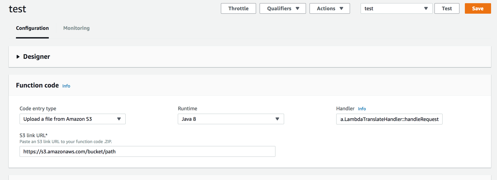

## Module-07 Add X-Ray and Lamdba SAM
In this module, we introduce you to the fundamental concept of X-Ray and features available to create and test your application. In addtion, you will be provided with hands-on on installing necessary tools and create your first application using X-Ray.
- Configure X-Ray daemon environment
- Create a Configuration for X-Ray in your applicaiton
- Configure X-Ray for SQL Queries
- Add code into AWS client for X-Ray
- Change Unit test code
- Create a SAM file for a Lambda
- Deploy a Lambda function using SAM

##### reference

[X-Ray SDK](https://docs.aws.amazon.com/xray/latest/devguide/xray-sdk-java.html)

### 1. Add X-Ray

##### 1. Setup X-Ray daemon for local and server
The AWS X-Ray daemon is a software application that listens for traffic on UDP port 2000, gathers raw segment data, and relays it to the AWS X-Ray API. The daemon works in conjunction with the AWS X-Ray SDKs and must be running so that data sent by the SDKs can reach the X-Ray service. 
[install X-Ray daemon](https://docs.aws.amazon.com/xray/latest/devguide/xray-daemon.html)

	1 download X-Ray daemon 
	2 run daemon (if it is MacOS, then command like a below)
	
```
/xray_mac -o -n us-east-1 & (for example)
```

##### 2. Add packages in pom.xml

```
	<dependencyManagement>
	  <dependencies>
...		
	    <!-- xray -->
	    <dependency>
	      <groupId>com.amazonaws</groupId>
	      <artifactId>aws-xray-recorder-sdk-bom</artifactId>
	      <version>1.3.1</version>
	      <type>pom</type>
	      <scope>import</scope>
	    </dependency>			        	    	    
	  </dependencies>
	</dependencyManagement> 
	
    <!-- AWS SDK xray -->        
		<dependency>
	    <groupId>com.amazonaws</groupId>
	    <artifactId>aws-xray-recorder-sdk-core</artifactId>
	  </dependency>
	  <dependency>
	    <groupId>com.amazonaws</groupId>
	    <artifactId>aws-xray-recorder-sdk-apache-http</artifactId>
	  </dependency>
	  <dependency>
	    <groupId>com.amazonaws</groupId>
	    <artifactId>aws-xray-recorder-sdk-aws-sdk</artifactId>
	  </dependency>
	  <dependency>
	    <groupId>com.amazonaws</groupId>
	    <artifactId>aws-xray-recorder-sdk-aws-sdk-instrumentor</artifactId>
	  </dependency>
	  <dependency>
	    <groupId>com.amazonaws</groupId>
	    <artifactId>aws-xray-recorder-sdk-sql-postgres</artifactId>
	  </dependency>
	  <dependency>
	    <groupId>com.amazonaws</groupId>
	    <artifactId>aws-xray-recorder-sdk-sql-mysql</artifactId>
	  </dependency>  	
	
```

##### Add X-Ray configuration 
[X-Ray Java configuration](https://docs.aws.amazon.com/xray/latest/devguide/xray-sdk-java-configuration.html)
The X-Ray SDK for Java provides a class named AWSXRay that provides the global recorder, a TracingHandler that you can use to instrument your code. You can configure the global recorder to customize the AWSXRayServletFilter that creates segments for incoming HTTP calls.

```
@Configuration
public class XRayConfig {
  private static final Logger logger = LoggerFactory.getLogger(XRayConfig.class);

  @Bean
  public Filter TracingFilter() {
    return new AWSXRayServletFilter("Workshop");
  }

  @Bean
  public Filter SimpleCORSFilter() {
    return new SimpleCORSFilter();
  }

  static {
  	 System.out.println("\n##### Webconfig.java static AWSXRay ######################\n");
    AWSXRayRecorderBuilder builder = AWSXRayRecorderBuilder.standard().withPlugin(new EC2Plugin());

    URL ruleFile = XRayConfig.class.getResource("/sampling-rules.json");
    builder.withSamplingStrategy(new LocalizedSamplingStrategy(ruleFile));

    AWSXRay.setGlobalRecorder(builder.build());
  }
}
```

##### 2. Add segment to CustomConfigListner
Here is a tips for CustomConfigListner. 
CustomConfigListner is called before executing XRayConfig, this means we need to embed codes CustomConfigListner for prevent from errors.

```
public void onApplicationEvent(ApplicationEnvironmentPreparedEvent event) {
	
	AWSXRay.beginSegment("Workshop : Load ParameterStore");
	
	....
	
	AWSXRay.endSegment();
}		
		
```

##### 3. Configure X-Ray for SQL Queries
Instrument SQL database queries by adding the X-Ray SDK for Java JDBC interceptor to your data source configuration.

- PostgreSQL – com.amazonaws.xray.sql.postgres.TracingInterceptor
- MySQL – com.amazonaws.xray.sql.mysql.TracingInterceptor

So, change codes in CustomConfigListner

```
props.put("spring.mysql.datasource.driver-class-name", "com.mysql.jdbc.Driver");
// for X-Ray
props.put("spring.mysql.datasource.jdbc-interceptors", "com.amazonaws.xray.sql.mysql.TracingInterceptor");   
environment.getPropertySources().addFirst(new PropertiesPropertySource("myProps", props));
```

##### Add code in Client build
To instrument individual clients, remove the aws-sdk-instrumentor submodule from your build and add an XRayClient as a TracingHandler on your AWS SDK client using the service's client builder. 

```
AmazonRekognition rekognitionClient = AmazonRekognitionClientBuilder
	.standard()
	.withRequestHandlers(new TracingHandler(AWSXRay.getGlobalRecorder()))  // X-Ray
	.withRegion(region)
	.build();

AmazonTranslate translate = AmazonTranslateClientBuilder
	.standard()
	.withRegion(region)
	.withRequestHandlers(new TracingHandler(AWSXRay.getGlobalRecorder())) // X-Ray
	.build();	  	         
	  	         
```
 
##### 5. Channge UnitTest code
To run unit tests, we need to add X-Ray Segment to generate segment to trace, for example.

```
public class MySqlTest {
	
	@Autowired
	UserRepository repository;
  
	@Test
	public void test () {
		
		AWSXRay.beginSegment("MySQLTest test"); 
		
		repository.deleteAll();
		
		...
		
    AWSXRay.endSegment();
	}
```

### 2. SAM for Lambda
In this taks, we introduce how to deploy Lambda project using SAM file and aws cloudformation.

##### 1. Create a jar for Lambda in your Eclipse

- You need to change Lamdba projects to create *.jar package, split previous Lambda project into 3 individual Lambda project to create **jar** file to upload into S3

- Create module-08-lamdba-dynamodb, module-08-lamdba-rekognition, module-08-lamdba-translate
- Copy each handler class and model class to com.maazonaws.lambda and com.maazonaws.lambda.io
- Minimize Unit Test class
- Change pom.xml to generate Jar file(not war)

```
<groupId>seon</groupId>
<artifactId>module-07-lamdba-dynamodb</artifactId>
<version>1.0.0</version>
<packaging>jar</packaging>

... 

<build>
  <plugins>
    <plugin>
      <groupId>org.apache.maven.plugins</groupId>
      <artifactId>maven-shade-plugin</artifactId>
      <version>2.3</version>
      <configuration>
        <createDependencyReducedPom>false</createDependencyReducedPom>
      </configuration>
      <executions>
        <execution>
          <phase>package</phase>
          <goals>
            <goal>shade</goal>
          </goals>
        </execution>
      </executions>
    </plugin>
  </plugins>
</build>

```

- Run Maven building command

```
mvn clean compile test package
```

- Check output jar file in "target" folder

```
ls -al target
```
- packaging your Lambda project

```
mv target/module-07-lamdba-translate-1.0.0.jar .
unzip module-07-lamdba-translate-1.0.0.jar
rm -rf target tst src buildspec.yml pom.xml module-07-lamdba-translate-1.0.0.jar
aws cloudformation package --template lambda-package-example.yml --s3-bucket <your bucket> --output-template template-export.yml

```

##### 2. Upload Jar file to S3 bucket
for example, if you created a Lambda for translate, then you can upload "module-07-lamdba-translate-1.0.0.jar" into S3 bucket using following AWS CLI command

```
cd target
aws s3 cp module-07-lamdba-translate-1.0.0.jar s3://<your bucket prefix>/module-07-lamdba-translate-1.0.0.jar --region us-east-1
```


##### 3. Create a test Lambda for this jar file
We create a Lambda function in module-06 and are able to update this function.

- Open a Lambda console
- Open the Lamdba function for translate
- Specify handler as "com.amazonaws.lambda.LambdaTranslateHandler::handleRequest"
- Specify S3 file path you uploaded in previous step.

	

- Save a Lambda fuction
- Run a test code

```
@Test
public void callTranslateLamdba()
{
	
	AWSXRay.beginSegment("callTranslateLamdba test"); 
	
	final MyLambdaServices myService = LambdaInvokerFactory.builder()
	 		 .lambdaClient(AWSLambdaClientBuilder.defaultClient())
	 		 .build(MyLambdaServices.class);
	 
	StepEventInput input = new StepEventInput();
	
	input.setText("Hello");
	input.setSourceLangCode("en");
	input.setTargetLangCode("es");
	 
	StepEventOutput output = myService.myTranslateFunc(input);  
	assertEquals(output.getTranslated(), "Hola.");
	
  
  AWSXRay.endSegment();	 
}	

```
- If you pass the unit test, then build all other Lambda projects and upload jar file to S3 bucket.
 
##### 4. Packaging your codes to zip using a SAM file for Lamdba (optional)
- Refer cfn-package-sam.yaml in scripts folder
- When you create a package for Java, all necesary files should be in your working directory, for example, complied classes and libraries. 
- If you want to use a Jar file you created in Lamdba project, then skip this step and goto step 5.

 
- SAM for translate Lambda function

```
AWSTemplateFormatVersion: '2010-09-09'
Transform: AWS::Serverless-2016-10-31
Resources:
  ServelessFunction:
    Type: AWS::Serverless::Function
    Properties:
      Handler: com.amazonaws.lambda.LambdaTranslateHandler::handleRequest
      Runtime: java8
      FunctionName: workshop-translate
      Role : arn:aws:iam::550622896891:role/<your role>
      MemorySize : 1024
      Timeout : 30   
      Environment:
        Variables: 
          S3_BUCKET: s3://seon-virginia-01
      Tags:
        ContactTag: Me            
          

```

```
aws cloudformation package --template-file lambda-translate.yaml --output-template-file serverless-output.yaml --s3-bucket seon-virginia-01
```

- check serverless-output.yaml


##### 5. Deploy your codes to zip using a SAM file for Lambda (optional)

- Create a SAM file for each Lamdba function. (You need to change a function name to check a creating new Lamdba function through SAM.
- Refer : 
https://docs.aws.amazon.com/lambda/latest/dg/serverless-deploy-wt.html

https://docs.aws.amazon.com/AWSCloudFormation/latest/UserGuide/transform-aws-serverless.html

**translate-lambda-sam.yaml**

```
AWSTemplateFormatVersion: '2010-09-09'
Resources:
  ServelessFunction:
    Properties:
      CodeUri: s3://<your bucket>/module-07-lamdba-translate-1.0.0.jar
      Environment:
        Variables:
          S3_BUCKET: s3://seon-virginia-01
      FunctionName: workshop-translate
      Handler: com.amazonaws.lambda.LambdaTranslateHandler::handleRequest
      MemorySize: 1024
      Role: arn:aws:iam::550622896891:role/Alexa-DevOps-Role
      Runtime: java8
      Tags:
        ContactTag: Me
      Timeout: 30
    Type: AWS::Serverless::Function
Transform: AWS::Serverless-2016-10-31

```

- run command

```
aws cloudformation deploy --template-file <your path>/translate-lambda-sam.yaml --stack-name <YOUR STACK NAME> 


Waiting for changeset to be created..
Waiting for stack create/update to complete
Successfully created/updated stack - test-translate
```

- Check the result in Cloudformatin console
- Check a created Lambda function in console
- Test a function (workshop-translate) using follwing input

```
{
    "text":"hello world", 
    "sourceLangCode":"en", 
    "targetLangCode":"es"
}
```
- Run a Unit test

##### 6. Implement all
	1. Implement all other SAM file for Lambda function 
	2. Deploy Lambda functions using aws cli
	3. Run a unit test 


