## Module-08 Create a CI/CD for first Deployment on AWS and dockerization

In this module, we introduce the fundamental concept of CodeStar and how to build a quick CI/CD pipeline with CodeStar. You will be provided with hands-on on migrating your project to CodeStar project you created and how to build docker environment for your application
- Create a CodeStar project
- Create a Cloud9 IDE environment for CI/CD
- Configure Cloud9 and Deploy instanace environment for first deploy
- Modify appsepc.xml and buildspec.xml 
- Deploy your first application through a CI/CD created by CodeStar
- Deploying Lambda in CI/CD
- Create a docker for your application and deploy through CI/CD

**Default Region : Virginia (US-EAST-1)**

Contributor : Jean Koay (AWS SA)
<hr>

### 0. Before starting this module
If you want to run module-04 application here without completing the previous modules, you need to configure  parameter store, DynamoDB, Aurora for MySql and role for EC2 in this step.

#### 0.1. Create data stores for this application (Aurora MySQL)

	1. Open the Amazon RDS console : https://console.aws.amazon.com/rds/home?region=us-east-1#
	2. Select Aurora for MySQL 5.7 Database engine and select the 
	3. Create a DB instance configuring database name, username, password.
	4. Remember your master username and password to perform next step
	


	5. Create database in configuration page (for example, workshop)
	
Name your Aurora database as TSA-Workshop, and keep the rest of the values as default.
- Select db instances of your choice (e.g. db.t2.micro)
- Keep the default multi-AZ
- Cluster name: TSA-Workshop-Cluster
- Database name: workshop
- Make sure that the database is publicly accessible.
- Keep everything else as default and then launch the Aurora database.
- At your left panel, click on the 'instances' menu. You should see that RDS is creating two database instances for you (one reader and writer role respectively).
	
	6. Wait until completing the creation of Aurora for MySQL 
Endpoint looks like this - "tsa-workshop.ctdltt3xxxx.us-east-1.rds.amazonaws.com"
	
	7. Check Endpoint and Security Group

	
	8. Change Security Group configuration, if you need.
Copy the security group of your rds - e.g. sg-6ec31b27, go to EC2 look up for the security group. Under Inbound rules, check whether it allows access from your computer.
 
Here is where you can download free mysql workbench:
https://dev.mysql.com/downloads/workbench/
	
	
	9. Check connectivity from your local computer (if you don't have any MySQL client, please install it)
If you're using macosx, you may key in the following command to access your db instance.
 
Otherwise, if you are using MySQL workbench, click on the ( + ) sign to add new db connection. Name your db connection and then paste the rds endpoint under the hostname: e.g. tsa.ctdltt3njgue.us-east-1.rds.amazonaws.com
 
Put in your username & password - same as the info you keyed in during the RDS creation.
 
click 'Test Connection'

	
```
mysql -h <endpoint of your instance> -u <master username> -p
```
	
	10. Create user and it's privilege using following SQL commands(use MySQL client in your computer)

```
mysql> create user 'demouser'@'%' identified by '12345678'; -- Creates the user
mysql> grant all on workshop.* to 'demouser'@'%'; -- Gives all the privileges to the new user on the newly created 
```

	11. Create User table 

```
USE workshop;

CREATE TABLE `User` (
  `id` integer NOT NULL AUTO_INCREMENT,
  `name` varchar(255) DEFAULT NULL,
  `email` varchar(255) DEFAULT NULL,
  PRIMARY KEY (`id`)
) ENGINE=InnoDB AUTO_INCREMENT=4 DEFAULT CHARSET=utf8;

```

	12. Check the table created

```
show tables;

describe User;
```

	13. You can use GUI tool for MySQL (for example, DBVisualizer)
	
	


#### 0.2. Create data stores for this application (DynamoDB)
Create a table names as "PhotoInfo" with key "id"

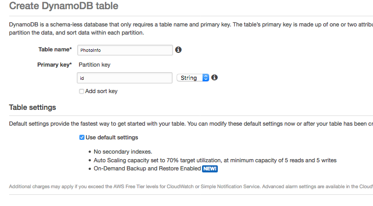


#### 0.3. Configure ParameterStore in System Manager 

AWS Systems Manager Parameter Store provides secure, hierarchical storage for configuration data management and secrets management. You can store data such as passwords, database strings, and license codes as parameter values.
Complete the following tasks to configure application parameters for ParameterStore (default region is us-east-1)

	1. Open the Amazon EC2 console at https://console.aws.amazon.com/ec2/
	2. Create parameters in ParameterStore for database URL, database username and password


	3. Add datasource.url, datasource.username, datasource.password for your Aurora instance. 
	   Specify values as you configured in previous steps.
	


#### 0.4. Create a role for EC2 
Create a role for EC2 with enough access privilege and attach it to dev/prod instance. (You can do it later, after step 1.3) 


#### 0.5. Create a git credentials for AWS CodeCommit
If you don't have a git credentials for CodeCommit, then create it in IAM console
IAM > Users > <your user name > > Security Credential Tab

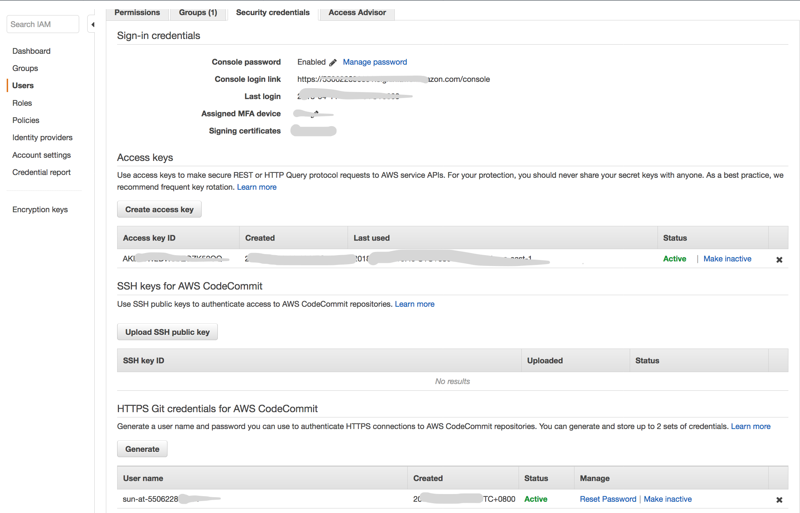


<hr>

### 1. First CI/CD using CodeStar with Java Spring application

#### 1.1. Create a CodeStart project name as "workshop-java"

	1. Select a project template (Java, Webapplication with Spring in EC2)

	
	2. Select CodeCommit as a code repository 
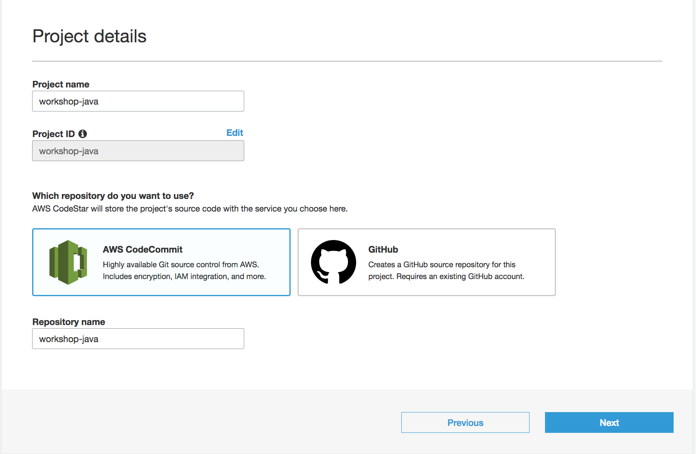	
	
	3. Choose your key pair (if you don't have a key pair for default region, create it in EC2)
	4. Choose Cloud9 to edit your code 
		

	5. Select a instance type and launch the project
	6. After creating the project, launch a Cloud9 IDE
	
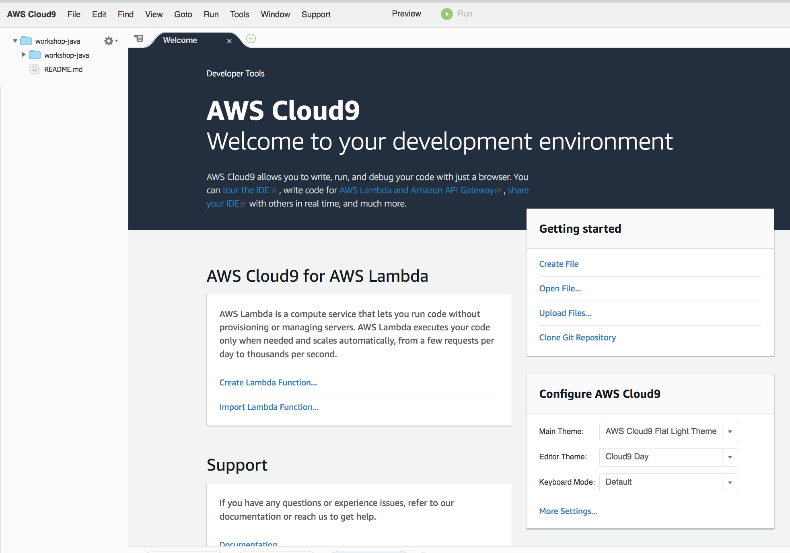		

#### 1.2. Open Cloud9 and configure the dev environtment
	1. Open a Cloud9 IDE and check it's first application in folder.
	   If you selected a project name as "workshop-java", then there is directory for source code with same name.
	   
	
  
	2. Open the application endpoints and check it's availability
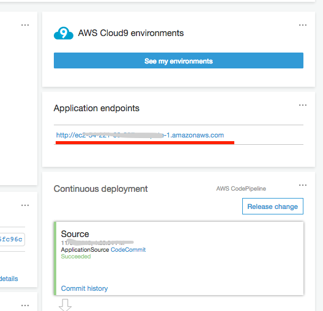		


#### 1.3. Upgrade a dev instance
	1. Check java --version and check the location of Java 
```
$ java -version
java version "1.7.0_171"

$ which java
/usr/bin/java

```
	
	2. Upgrade java version to 1.8 (for development, we need to upgrade Java version and install required packages)
	
```
sudo yum list available java\*      # check available java version
sudo yum -y install java-1.8.0 java-1.8.0-openjdk-devel        # install 1.8 java and javac
sudo yum remove java-1.7.0-openjdk -y # remove 1.7
java -version											# check java version
```

	4. Update JAVA_HOME environment variable in .bashrc

```
vi ~/.bashrc
### add follwing content
export JAVA_HOME=/usr/
```
	
	4. Install Maven

```
$ cd /usr/local
$ sudo wget http://www-eu.apache.org/dist/maven/maven-3/3.5.3/binaries/apache-maven-3.5.3-bin.tar.gz
$ sudo tar xzf apache-maven-3.5.3-bin.tar.gz
$ sudo ln -s apache-maven-3.5.3  maven

$ sudo vi /etc/profile.d/maven.sh

# add following content.
export M2_HOME=/usr/local/maven
export PATH=${M2_HOME}/bin:${PATH}

# load the environment variables in current shell using following command.
source /etc/profile.d/maven.sh

# check the loaded environment variables  
echo $PATH             
```

#### 1.4. Check the result of previous step 
	1. Run following command to check no erros (in terminals in your code)

```	
	cd <your_source folder>

	mvn -f pom.xml compile
	mvn -f pom.xml package
```
	If you want to run this application, then copy the built application to the Tomcat webapp directory that you configured in your local machine or ec2 instance on AWS
	
	2. Change a index.jsp file 
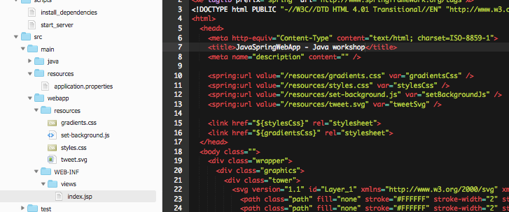			

	3. Push the source codes and the changes of CodePipeline in CodeStar dashboard
	
```
git add .
git commit -m "first change"
git push
```

#### 1.5. Update the product instance with same configurations

	1. Check your CodeStar instance created for deployment in EC2 console 
	2. Connect to the instance using CLI 

```
ssh -i <your_key> ec2-user@<IP>
```

	3. Upgrade Java to 1.8 in the instance of CodeDeploy	
	
```
sudo yum list available java\*      # check available java version
sudo yum install java-1.8.0 java-1.8.0-openjdk-devel  -y      # install 1.8 java and javac
sudo yum remove java-1.7.0-openjdk -y  # remove 1.7
java -version											# check java version
```


#### 1.6. (Cloud9) Download module-04 application and replace it with your application in Cloud9
	1. Delete all source codes in your project source 
	
```
	rm -rf src scripts target pom.xml
```
			
	2. Create a directory for downloading the source codes
```
cd ~\environment
mkdir workshop
cd workshop
git clone https://github.com/aws-asean-builders/aws-java-spring-dev-workshop
cd aws-java-spring-dev-workshop/module-04

cp -R appspec.yml buildspec.yml pom.xml scripts src ~/environment/<your codestart source directory>
```
	

#### 1.6.(Eclipse IDE) download this first application on your local Eclipse IDE
	1. open CodeCommit and copy Clone URL
	2. fetch source codes.
	3. if you don't have a CodeCommit username and password, please refer this documentation :
	https://docs.aws.amazon.com/codecommit/latest/userguide/setting-up-gc.html
	4. import this project to your Eclipse IDE
	5. Run following commands

```
mvn -f pom.xml compile
mvn -f pom.xml package -Dmaven.test.skip=true
```
		
	6. if you got a following errors,
	
	7. add following content in pom.xml
	<properties>
		...
		<maven.compiler.source>1.8</maven.compiler.source>
		<maven.compiler.target>1.8</maven.compiler.target>
	</properties>
	8. check the result of compilation
	
	


#### 1.7. Check copied module-04 application and change pom.xl

We use module-04 source code for the created CI/CD.
if you get a compilation errors in your project, please check the Java compiler version and JRE, change compiler version and JRE in your application (1.8)

	1. Change Pom.xml 
```	
<build>
	<finalName>ROOT</finalName>
    <plugins>
        <plugin>
            <groupId>org.springframework.boot</groupId>
            <artifactId>spring-boot-maven-plugin</artifactId>
        </plugin>
    </plugins>
</build>
```

	2. Run following commands and check the results

```
mvn -f pom.xml compile
mvn -f pom.xml package -Dmaven.test.skip=true
```

	3. Check you created ROOT.jar in target directory
```
$ ls  target/ROOT.jar
target/ROOT.jar
```
	
	
#### 1.8. Change appspecc.xml, buildspec.xml and scripts	
You can use appspec.xml and buildspec.xml in module-04. just compare it to the original project's files.

	1. Change appsecc.xml, buildspec.xml and scripts	
buildspec.xml

```
  build:
    commands:
      - echo Build started on `date`
      - mvn package -Dmaven.test.skip=true
      
```

	2. script/start_server.sh 
	   it is very important to return the success code as a result of script file for CodeDeploy

```
#!/bin/bash
cd /home/ec2-user/javaapp
java -jar ROOT.jar &
echo $? # return success code
```

	3. If you want to check the availability of this package then just run following commands and check the output in target folder

```
mvn package -Dmaven.test.skip=true

java -jar target/ROOT.jar

curl 'localhost:8080/workshop/deleteall'
curl 'localhost:8080/workshop/add?name=First&email=ex1@gmail.com'
curl 'localhost:8080/workshop/all'

```

	
#### 1.9. commit source codes into CodeCommit
	1.push the codes into CodeCommit.

```
git add .
git commit -m "add first module-04"
git push 

```


	


##### 1.9. Change Credentials
You probably get a error message in CodeDeploy.

```
Caused by: org.springframework.beans.factory.BeanCreationException: Error creating bean with name 'photoInfoRepository': Cannot resolve reference to bean 'amazonDynamoDB' while setting bean property 'amazonDynamoDB'; nested exception is org.springframework.beans.factory.BeanCreationException: Error creating bean with name 'amazonDynamoDB' defined in class path resource [hello/config/DynamoDBConfig.class]: Bean instantiation via factory method failed; nested exception is org.springframework.beans.BeanInstantiationException: Failed to instantiate [com.amazonaws.services.dynamodbv2.AmazonDynamoDB]: Factory method 'amazonDynamoDB' threw exception; nested exception is org.springframework.beans.factory.BeanCreationException: Error creating bean with name 'amazonAWSCredentials' defined in class path resource [hello/config/DynamoDBConfig.class]: Bean instantiation via factory method failed; nested exception is org.springframework.beans.BeanInstantiationException: Failed to instantiate [com.amazonaws.auth.AWSCredentials]: Factory method 'amazonAWSCredentials' threw exception; nested exception is com.amazonaws.AmazonClientException: Cannot load the credentials from the credential profiles file. Please make sure that your credentials file is at the correct location (/Users/userid/.aws/credentials), and is in a valid format.

```
This is because of a credentials, fix the source code in DynamoDBConfig

```
public AmazonDynamoDB amazonDynamoDB() {
    AmazonDynamoDB amazonDynamoDB = AmazonDynamoDBClientBuilder.standard()
       .build();
    return amazonDynamoDB;
}
```

#### 1.10. Check Security Group and Role for Dev instance
You probably succeeded a deployment but failed to test step 8 (previous step)
So you need to find out what causes these problems.
	
	1. Need to open 8080 port in Securty Group.
	2. Login to deploy instance and run following commands
```
 	java -jar javaapp/Root.jar
 	
 	You can see the following error messages
 	 	
  ....is not authorized to perform: ssm:GetParameter on resource: arn:
```
	3. This means you need to update the role to have enough privileges for deployment EC2 instance. (Parameter Store, DyanamoDB)
	4. Open IAM and edit the role attached to development EC2 instance.
	
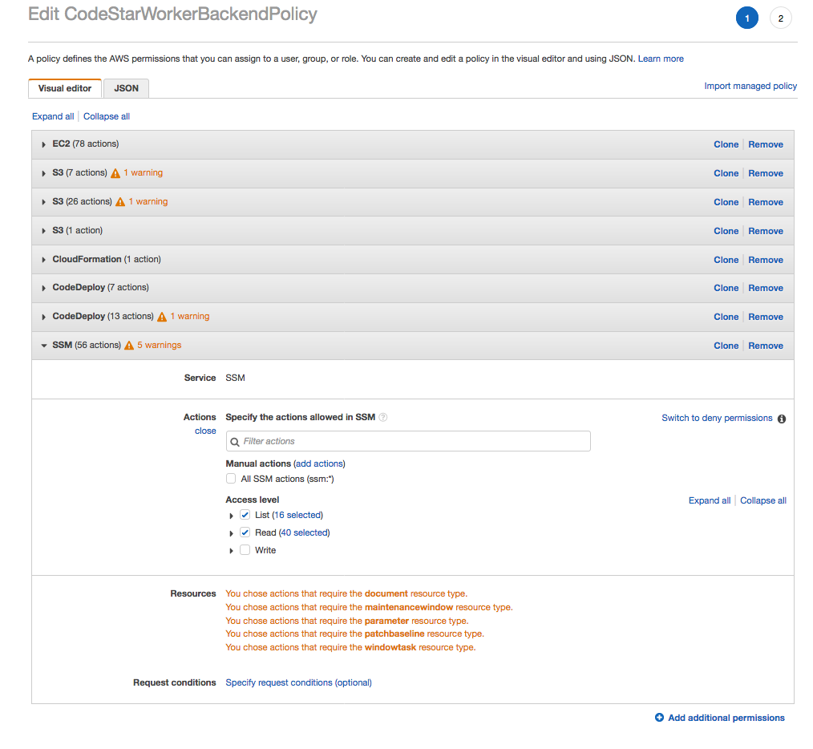	
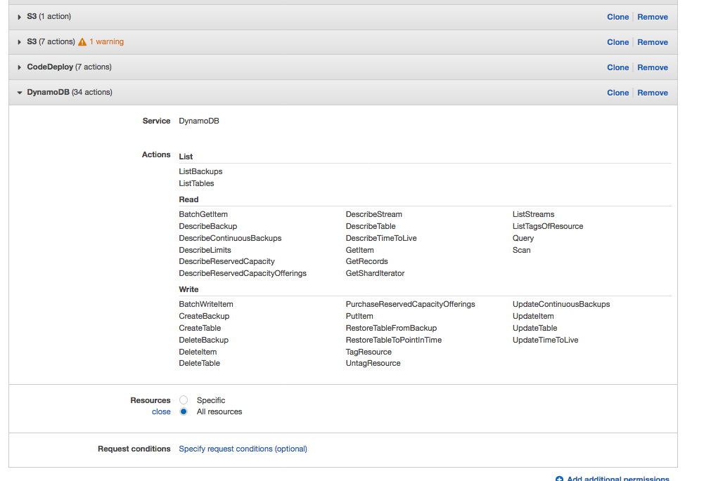			

	5. Run again your application and repeat 4 to get a enough privilege

	6. Update Security Group for Aurora to access from EC2 instance


##### 1.11. Check the application
```
curl '<endpoints>:8080/workshop/deleteall'
curl '<endpoints>:8080/workshop/add?name=First&email=ex1@gmail.com'
curl '<endpoints>:8080/workshop/all'
```
or in your web browser

```
<endpoints>:8080/users
```
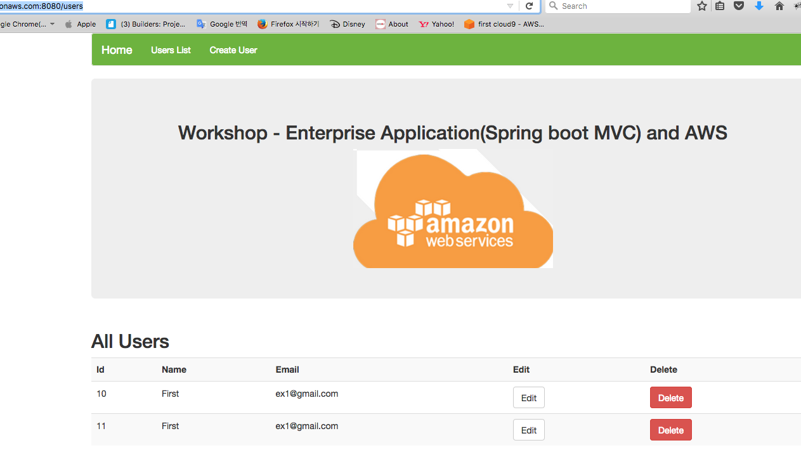	

<hr>

You just completed the first deployment of your application.


<hr>

### 2. CI/CD with Lambda using SAM
refer : https://docs.aws.amazon.com/lambda/latest/dg/automating-deployment.html

#### 2.1. Create CodeStar project for Lambda project

	1. create a CodeStar project using template
	2. Choose Java and web service (Lambda) 

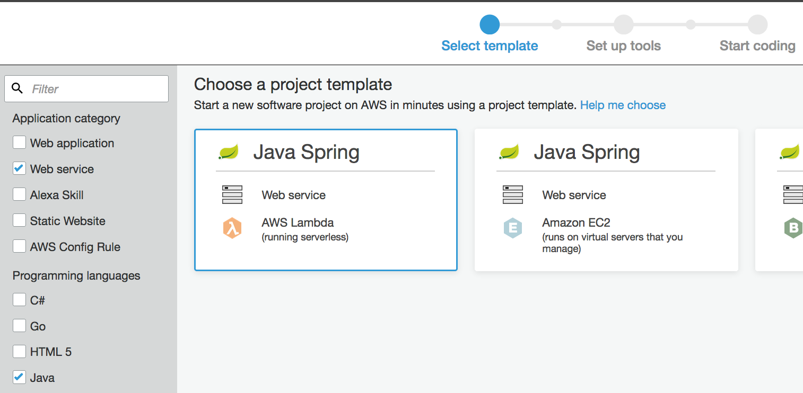	

	3. select Eclipse for your editor
	


	4. Import the created Codestar project into Eclipse
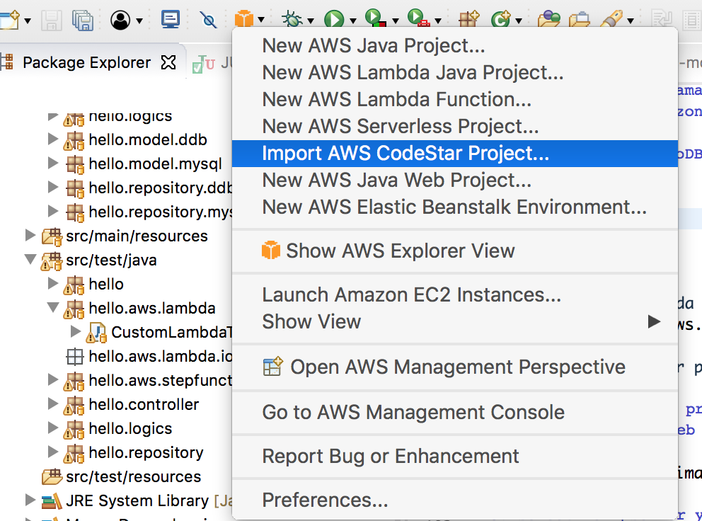


#### 2.2. Change the codestar project	

This template project will create API with Get/Post and 2 Lambda functions for Get/Post
We will not create API, just will use module-07-lambda-translate, so change the codes in template project.
- Ref : module-08-lambda-codestar

	1. Add following content in Pom.xml 

```
 <!-- AWS SDK rekognition -->  
   <dependency>
    <groupId>com.amazonaws</groupId>
    <artifactId>aws-java-sdk-translate</artifactId>
     <version>1.11.295</version>
  </dependency>  
```
	2. change groudId and artifactId

```
<groupId>seon</groupId>
<artifactId>module-07-lamdba-translate</artifactId>
```

	2. remove all source codes of template project and copy and paste source code from module-07-lambda-translate project.
	
	3. change a buildspec.yml

```
build:
  commands:
    - echo Build started on `date`
    - mvn package shade:shade
    - mv target/module-07-lamdba-translate.jar .
    - unzip module-07-lamdba-translate.jar
    - rm -rf target tst src buildspec.yml pom.xml module-07-lamdba-translate.jar
    - aws cloudformation package --template template.yml --s3-bucket $S3_BUCKET --output-template template-export.yml

```

	4. change template.yml

```
AWSTemplateFormatVersion: 2010-09-09
Transform:
- AWS::Serverless-2016-10-31
- AWS::CodeStar

Parameters:
  ProjectId:
    Type: String
    Description: AWS CodeStar projectID used to associate new resources to team members

Resources:
  ServelessFunction:
    Type: AWS::Serverless::Function
    Properties:
      Handler: com.amazonaws.lambda.LambdaTranslateHandler::handleRequest
      Runtime: java8
      FunctionName: workshop-translate
      Role : Alexa-DevOps-Role
      MemorySize : 1024
      Timeout : 30   
      Environment:
        Variables: 
          S3_BUCKET: s3://seon-virginia-01
      Tags:
        ContactTag: workshop-translte 
        
 ```
	
#### 2.3. Update policy
if you get a error message in CodeDeploy

User: arn:aws:sts::<id>:assumed-role/<Role name>/AWSCloudFormation is not authorized to perform: iam:PassRole on resource: <arn for your Role to attach>

This means the role you want to pass to CloudFormation is not configured in the Role that CodeStar prject is using.
Add the following content in the role of CodeStar project

```
        {
            "Sid": "VisualEditor0",
            "Effect": "Allow",
            "Action": [
                "iam:PassRole"
            ],
            "Resource": [
                "arn for your Lambda function"
            ]
        },
```

	5. commit codes and check your project
	6. run a test code in module-07 
	
```
@Test
public void callTranslateLamdba()
{
	
	AWSXRay.beginSegment("callTranslateLamdba test"); 
	
	final MyLambdaServices myService = LambdaInvokerFactory.builder()
	 		 .lambdaClient(AWSLambdaClientBuilder.defaultClient())
	 		 .build(MyLambdaServices.class);
	 
	StepEventInput input = new StepEventInput();
	
	input.setText("Hello");
	input.setSourceLangCode("en");
	input.setTargetLangCode("es");
	 
	StepEventOutput output = myService.myTranslateFunc(input);  
	assertEquals(output.getTranslated(), "Hola.");
	
  
  AWSXRay.endSegment();	 
}	

```

<hr>

### 3. Upgrade a CodeStar project for multiple Lambda functions
In this step, we will introduce how to build one CodePipleline for multiple Lamdba project. We will add a parallel action in deploy stage for deploying multiple Lambda functions.

This section covers the following tasks.
- Create multiple Lambda projects
- Create a buildspec of CodeBuild for multiple Lambda projects.
- Create a CloudFormation stack
- Expend a previous CodePipeline (section 2).	

#### 3.1. Create mutiple Lambda projects 
Create several Lambda projects as following hierarchical structure

```
- root - buildspec.yml
       - Lambda 1 project 
       		- pom.xml
         	- template.yml
       - Lambda 2 project
           - pom.xml
         	- template.yml
```

#### 3.2. Change a buildspec.xml

```
  build:
    commands:
      # translate
      - echo Build translate started on `date`
      - cd lambda-codestar-translate
      - mvn clean compile test
      - mvn package shade:shade
      - mv target/lambda-codestar-translate-1.0.jar .
      - unzip lambda-codestar-translate-1.0.jar
      - rm -rf target tst src pom.xml lambda-codestar-translate-1.0.jar
      - aws cloudformation package --template template.yml --s3-bucket $S3_BUCKET --output-template template-translate.yml
      - cp template-translate.yml ..
      # rekognition
      - echo Build rekognition started on `date`
      - cd  ../lambda-codestar-rekognition
      - mvn clean compile test      
      - mvn package shade:shade
      - mv target/lambda-codestar-rekognition-1.0.jar .
      - unzip lambda-codestar-rekognition-1.0.jar
      - rm -rf target tst src pom.xml lambda-codestar-rekognition-1.0.jar
      - aws cloudformation package --template template.yml --s3-bucket $S3_BUCKET --output-template template-rekognition.yml
      - cp template-rekognition.yml ..

```

#### 3.3. Add a parallel action in Deploy Stage
- Add a generate change set

	1. Specify stack name, for example : **awscodestar-lambda-codestar-lambda-reko**
	2. Specify change set name, for example : **pipeline-changeset**
	3. Add Parameter overrides : {"ProjectId":"lambda-codestar"}
	4. Specify input artifiact name : lambda-codestar-BuildArtifact

- Add a Execute change set

	1. Specify stack name, for example : **awscodestar-lambda-codestar-lambda-reko**
	2. Specify change set name, for example : **pipeline-changeset**

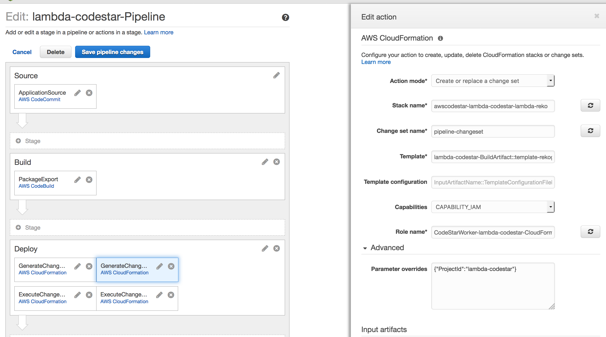

#### 3.4. Change a policy of CodePipeline
Add a new CloudFormation stack as a target resource. 

```
"Resource": [
    "arn:aws:iam::550622896891:role/CodeStarWorker-lambda-codestar-CloudFormation",
    "arn:aws:cloudformation:us-east-1:5506228xxxxx:stack/awscodestar-lambda-codestar-lambda/*",
    "arn:aws:cloudformation:us-east-1:5506228xxxxx:stack/awscodestar-lambda-codestar-lambda-reko/*",
```

#### 3.5. Deploy a new deployment
- Release change


<hr>


