## Module-08 Create a CI/CD for first Deployment on AWS and dockerization

In this module, we introduce the fundamental concept of CodeStar and how to build a quick CI/CD pipeline with CodeStar. You will be provided with hands-on on migrating your project to CodeStar project you created and how to build docker environment for your application
- Create a CodeStar project
- Create a Cloud9 IDE environment for CI/CD
- Configure Cloud9 and Deploy instanace environment for first deploy
- Modify appsepc.xml and buildspec.xml 
- Deploy your first application through a CI/CD created by CodeStar
- Deploying Lambda in CI/CD
- Create a docker for your application and deploy through CI/CD

**Default Region : Virginia (US-EAST-1)**

<hr>

### 0. Before starting this module
if you want to run module-04 application here without following the previous steps, you should configure the parameter store, dynamodb, Aurora for MySql and role for EC2 in this step.

##### 1. Create data stores for this application (Aurora MySQL)

	1. Open the Amazon RDS console : https://console.aws.amazon.com/rds/home?region=us-east-1#
	2. Select Aurora for MySQL 5.7 Database engine 
	3. Create a DB instance configuring databasename, username, password.
	


	4. Wait until Aurora for MySQL launching
	5. Change parameter values in Parameter Store in EC2 to Aurora instance
	6. create database, user and it's privilege

```
mysql> create database workshop; -- Create the new database
mysql> create user 'demouser'@'localhost' identified by '12345678'; -- Creates the user
mysql> grant all on workshop.* to 'demouser'@'%'; -- Gives all the privileges to the new user on the newly created 
```

	7. crate User table

```
CREATE TABLE `User` (
  `id` integer NOT NULL AUTO_INCREMENT,
  `name` varchar(255) DEFAULT NULL,
  `email` varchar(255) DEFAULT NULL,
  PRIMARY KEY (`id`)
) ENGINE=InnoDB AUTO_INCREMENT=4 DEFAULT CHARSET=utf8 
```

##### 2. Create data stores for this application (DynamoDB)
Create a table names as "PhotoInfo" with key "id"

##### 3. Configure ParameterStore in System Manager 
AWS Systems Manager Parameter Store provides secure, hierarchical storage for configuration data management and secrets management. You can store data such as passwords, database strings, and license codes as parameter values.
Complete the following tasks to configure application parameters for ParameterStore (default region is us-east-1)

	1. Open the Amazon EC2 console at https://console.aws.amazon.com/ec2/
	2. Create parameters in ParameterStore for database URL, database username and password


	3. Add datasource.url, datasource.username, datasource.password for your Aurora instance. specify values as you configured in previous step.
	

##### 4. create a role for EC2 
Create a role for EC2 with enough privileages to attach it to dev/prod instance.


### 1. First CI/CD using CodeStart with Java Spring application

##### 1. Create a CodeStart project name as "workshop-java"

	1. Select a project template (Java, Webapplication with Spring in EC2)
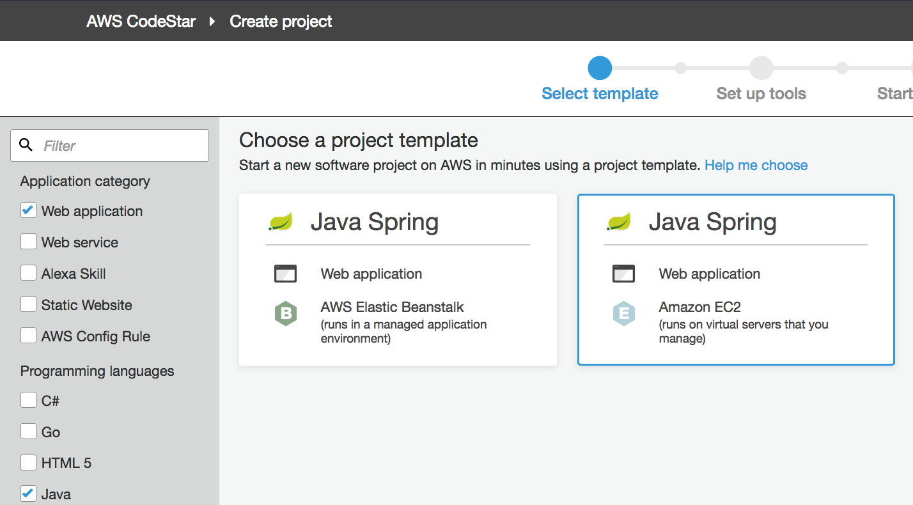
	
	2. Select CodeCommit as a code repository 
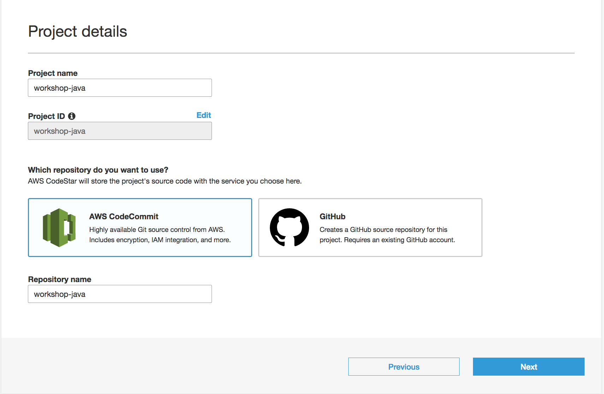	
	
	3. Choose your key pair
	4. Choose Cloud9 to edit your code 
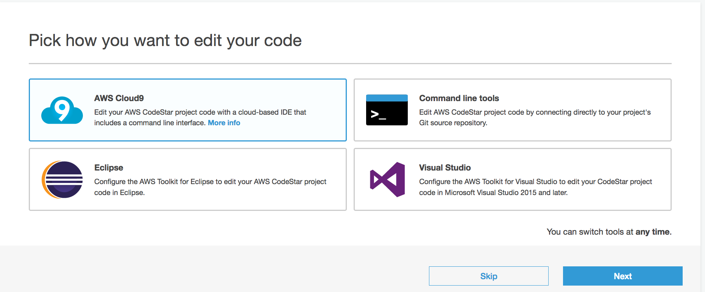		

	5. Select a instance type and launch the project
	6. After creating the project, launch a Cloud9 IDE
	
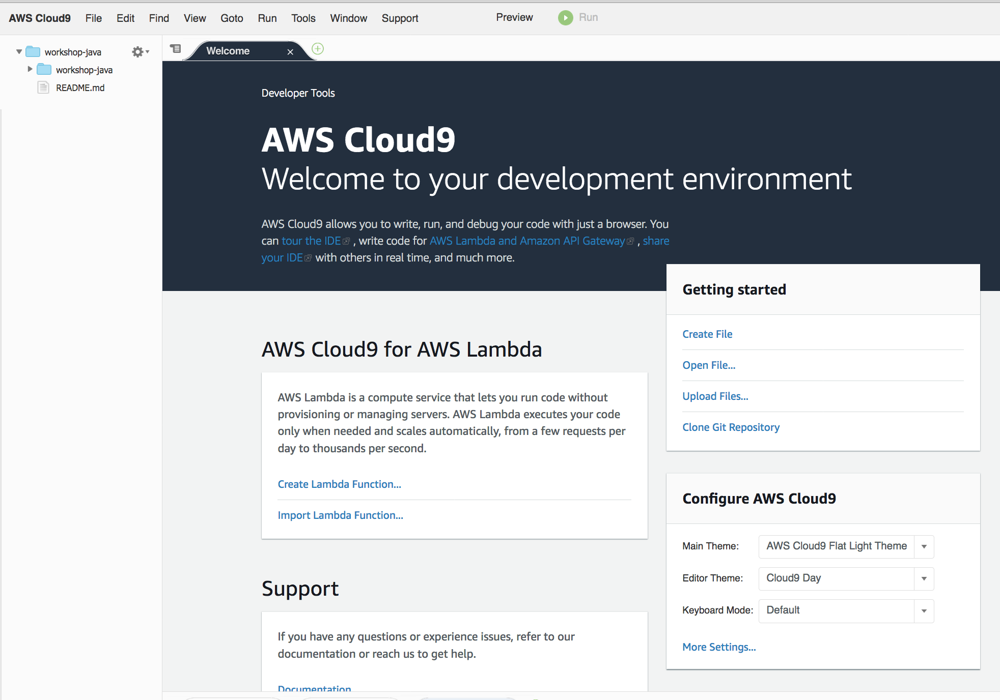		

##### 2. Open Cloud9 and configure the dev environtment
	1. Open a Cloud9 IDE and check it's first application in folder
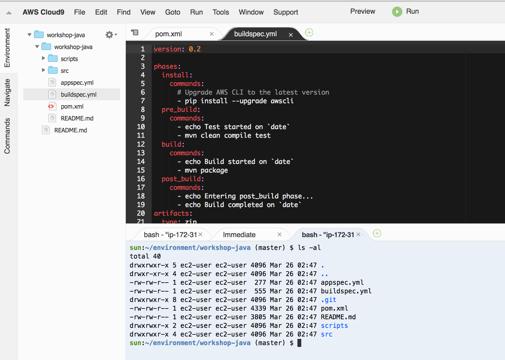	

	2. check java --version
	3. upgrade java version to 1.8 (for development, we need to upgrade Java version and install required pakcages)
	

```
sudo yum list available java\*      # check avaiable java version
sudo yum install java-1.8.0 java-1.8.0-openjdk-devel        # install 1.8 java and javac
sudo yum remove java-1.7.0-openjdk  # remove 1.7
java -version											# check java version
```
	4. update JAVA_HOME in the environment variable in .bashrc


```
vi ~/.bashrc
### add follwing content
export JAVA_HOME=/usr/
```
	
	4. Install Maven

```
$ cd /usr/local
$ sudo wget http://www-eu.apache.org/dist/maven/maven-3/3.5.3/binaries/apache-maven-3.5.3-bin.tar.gz
$ sudo tar xzf apache-maven-3.5.3-bin.tar.gz
$ sudo ln -s apache-maven-3.5.3  maven

$ sudo vi /etc/profile.d/maven.sh

# add following content.
export M2_HOME=/usr/local/maven
export PATH=${M2_HOME}/bin:${PATH}

# load the environment variables in current shell using following command.
source /etc/profile.d/maven.sh

# check the loaded environment variables  
echo $PATH             
```

##### 3. Update the instance of Deployment

	1. check your prod instance in your console.
	2. connect to the instance using CLI 

```
ssh -i <your_key> ec2-user@<IP>
```

	3. upgrate Java to 1.8 in the instance of CodeDeploy
	
	
```
sudo yum list available java\*      # check avaiable java version
sudo yum install java-1.8.0 java-1.8.0-openjdk-devel        # install 1.8 java and javac
sudo yum remove java-1.7.0-openjdk  # remove 1.7
java -version											# check java version
```


##### 3. first fetching source codes from CodeComnit
	1. Perform tasks following the instruction in CodeCommit for the first application
	2. Run following command

	mvn -f pom.xml compile
	mvn -f pom.xml package
	
	3. If you want to run this application, then copy the built application to the Tomcat webapp directory that you configured in your local machine or ec2 instance on AWS
	
##### 4. download this first application on your local Eclipse IDE
	1. open CodeCommit and copy Clone URL
	2. fetch source codes.
	3. if you don't have a CodeCommit username and password, please refer this documentation :
	https://docs.aws.amazon.com/codecommit/latest/userguide/setting-up-gc.html
	4. import this project to your Eclipse IDE
	5. Run follwing commands

```
mvn -f pom.xml compile
mvn -f pom.xml package
```
		
	6. if you got a following errors,
	
	7. add following content in pom.xml
	<properties>
		...
		<maven.compiler.source>1.8</maven.compiler.source>
		<maven.compiler.target>1.8</maven.compiler.target>
	</properties>
	8. check the result of compilation
	
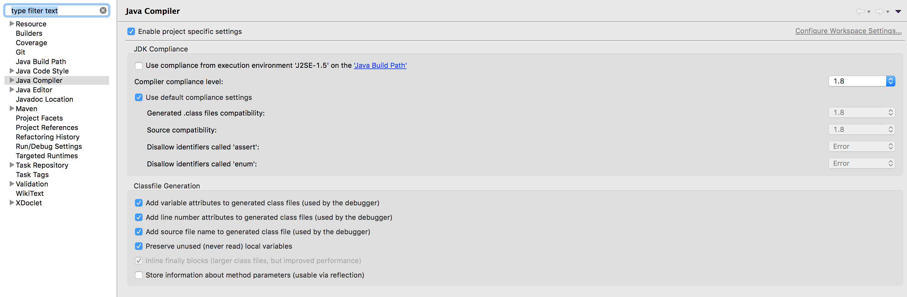	


##### 5. Create a new pom file for your application.
Firstly, we will use module-04 source code for the created CI/CD.

	1. rename pom.xml as pom-backup.xml
	2. create a new POM file name as "pom.xml" 
	3. merge the pom file in module-04 into workshop-java project you fetched from CodeCommit
	4. delete all source codes in "workshop-java" project and copy all source codes from module-04 to "workshop-java" project
	5. run Application.java and check the result of UnitTest.
	6. if you get a compilation errors in your project, please check the Java compiler version and JRE, change compiler version and JRE in your application (1.8)
	
##### 6. Change appspecc.xml, buildspec.xml and scripts	
	1. Change appsecc.xml, buildspec.xml and scripts	
appspec.xml

```
  build:
    commands:
      - echo Build started on `date`
      - mvn package -Dmaven.test.skip=true
      
```

	2. script/start_server.sh

```
#!/bin/bash
cd /home/ec2-user/javaapp
java -jar ROOT.jar 
```

	3. run follwing commands again and check the output in target folder

```
mvn package
java -jar target/ROOT.jar
```

	
##### 6. commit source codes into CodeCommit
	1. commit source codes in "workshop-java" project into CodeCommit.

```
git add .
git commit -m "add first module-04"
git push 

```


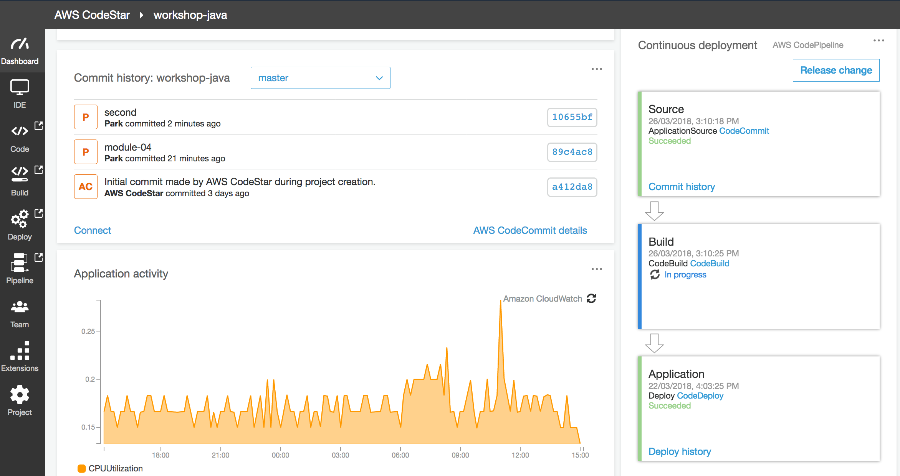	
##### 7. Change Credentials
You will probablly get a error message in CodeDeploy.

```
Caused by: org.springframework.beans.factory.BeanCreationException: Error creating bean with name 'photoInfoRepository': Cannot resolve reference to bean 'amazonDynamoDB' while setting bean property 'amazonDynamoDB'; nested exception is org.springframework.beans.factory.BeanCreationException: Error creating bean with name 'amazonDynamoDB' defined in class path resource [hello/config/DynamoDBConfig.class]: Bean instantiation via factory method failed; nested exception is org.springframework.beans.BeanInstantiationException: Failed to instantiate [com.amazonaws.services.dynamodbv2.AmazonDynamoDB]: Factory method 'amazonDynamoDB' threw exception; nested exception is org.springframework.beans.factory.BeanCreationException: Error creating bean with name 'amazonAWSCredentials' defined in class path resource [hello/config/DynamoDBConfig.class]: Bean instantiation via factory method failed; nested exception is org.springframework.beans.BeanInstantiationException: Failed to instantiate [com.amazonaws.auth.AWSCredentials]: Factory method 'amazonAWSCredentials' threw exception; nested exception is com.amazonaws.AmazonClientException: Cannot load the credentials from the credential profiles file. Please make sure that your credentials file is at the correct location (/Users/userid/.aws/credentials), and is in a valid format.

```
This is because of a credentials, please check below documentation and fix the source code in DynamoDBConfig

```
public AmazonDynamoDB amazonDynamoDB() {
    AmazonDynamoDB amazonDynamoDB = AmazonDynamoDBClientBuilder.standard()
       .build();
    return amazonDynamoDB;
}
```

<hr>

You just completed the first deployment of your application.


### 2. CI/CD with Lambda using SAM
refer : https://docs.aws.amazon.com/lambda/latest/dg/automating-deployment.html

##### 1. Create CodeStar project for Lambda project

	1. create a CodeStar project using template
	2. Choose Java and web service (Lambda) 

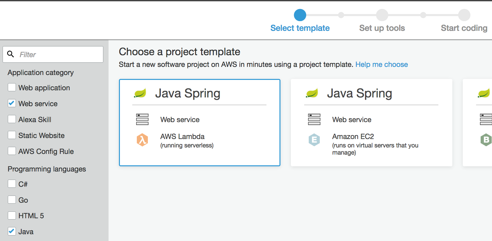	

	3. select Eclipse for your editor
	
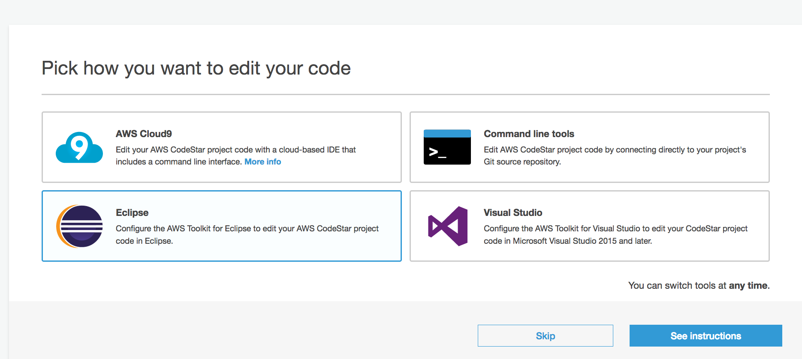

	4. Import the created Codestar project into Eclipse
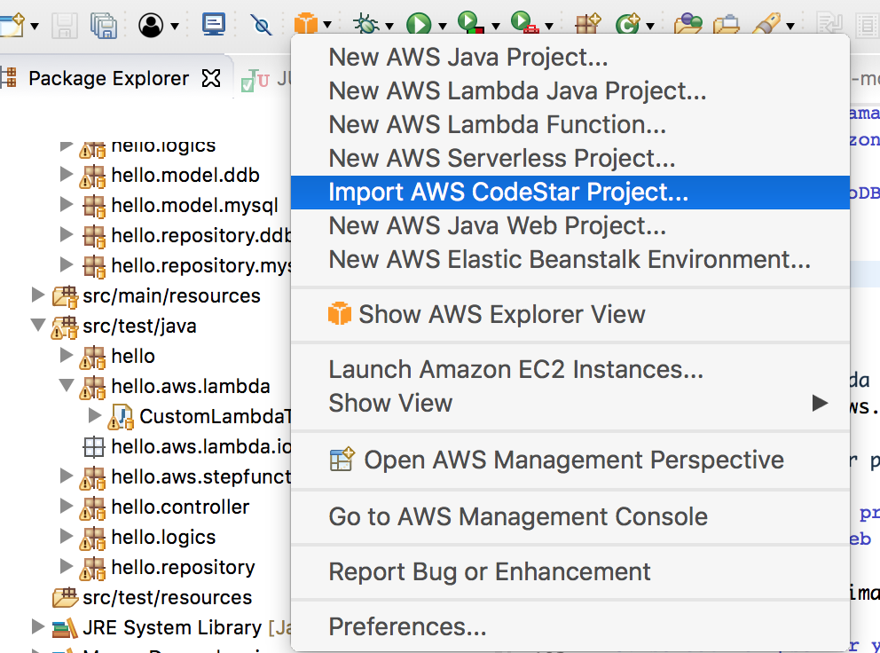
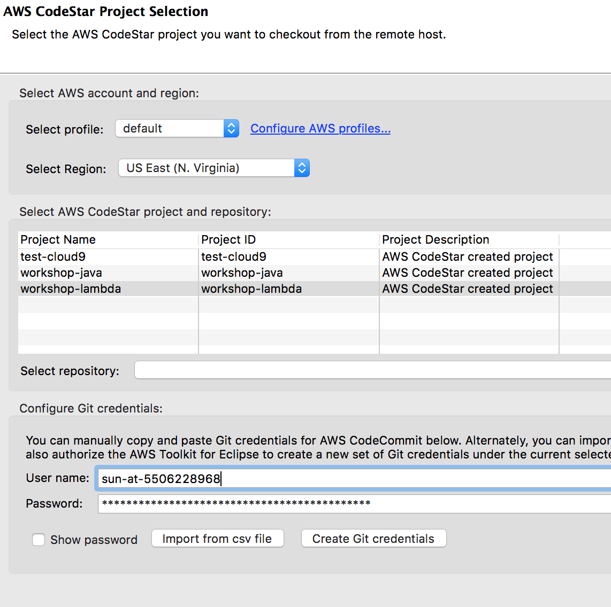

##### 2. Change the codestar project	

This template project will create API with Get/Post and 2 Lambda functions for Get/Post
We will not create API, just will use module-07-lambda-translate, so change the codes in template project.
- Ref : module-08-lambda-codestar

	1. Add following content in Pom.xml 

```
 <!-- AWS SDK rekognition -->  
   <dependency>
    <groupId>com.amazonaws</groupId>
    <artifactId>aws-java-sdk-translate</artifactId>
     <version>1.11.295</version>
  </dependency>  
```
	2. change groudId and artifactId

```
<groupId>seon</groupId>
<artifactId>module-07-lamdba-translate</artifactId>
```

	2. remove all source codes of template project and copy and paste source code from module-07-lambda-translate project.
	
	3. change a buildspec.yml

```
build:
  commands:
    - echo Build started on `date`
    - mvn package shade:shade
    - mv target/module-07-lamdba-translate.jar .
    - unzip module-07-lamdba-translate.jar
    - rm -rf target tst src buildspec.yml pom.xml module-07-lamdba-translate.jar
    - aws cloudformation package --template template.yml --s3-bucket $S3_BUCKET --output-template template-export.yml

```

	4. change template.yml

```
AWSTemplateFormatVersion: 2010-09-09
Transform:
- AWS::Serverless-2016-10-31
- AWS::CodeStar

Parameters:
  ProjectId:
    Type: String
    Description: AWS CodeStar projectID used to associate new resources to team members

Resources:
  ServelessFunction:
    Type: AWS::Serverless::Function
    Properties:
      Handler: com.amazonaws.lambda.LambdaTranslateHandler::handleRequest
      Runtime: java8
      FunctionName: workshop-translate
      Role : Alexa-DevOps-Role
      MemorySize : 1024
      Timeout : 30   
      Environment:
        Variables: 
          S3_BUCKET: s3://seon-virginia-01
      Tags:
        ContactTag: workshop-translte 
        
 ```
	
##### 3. Update policy
if you get a error message in CodeDeploy

User: arn:aws:sts::<id>:assumed-role/<Role name>/AWSCloudFormation is not authorized to perform: iam:PassRole on resource: <arn for your Role to attach>

This means the role you want to pass to CloudFormation is not configured in the Role that CodeStar prject is using.
Add the following content in the role of CodeStar project

```
        {
            "Sid": "VisualEditor0",
            "Effect": "Allow",
            "Action": [
                "iam:PassRole"
            ],
            "Resource": [
                "arn for your Lambda function"
            ]
        },
```

	5. commit codes and check your project
	6. run a test code in module-07 
	
```
@Test
public void callTranslateLamdba()
{
	
	AWSXRay.beginSegment("callTranslateLamdba test"); 
	
	final MyLambdaServices myService = LambdaInvokerFactory.builder()
	 		 .lambdaClient(AWSLambdaClientBuilder.defaultClient())
	 		 .build(MyLambdaServices.class);
	 
	StepEventInput input = new StepEventInput();
	
	input.setText("Hello");
	input.setSourceLangCode("en");
	input.setTargetLangCode("es");
	 
	StepEventOutput output = myService.myTranslateFunc(input);  
	assertEquals(output.getTranslated(), "Hola.");
	
  
  AWSXRay.endSegment();	 
}	
```
### 3. Upgrade a CodeStar project for multiple Lambda functions
In this step, we will introduce how to build one CodePipleline for multiple Lamdba project. We will add a parallel action in deploy stage for deploying multiple Lambda functions.

This section covers the following tasks.
- Create multiple Lambda projects
- Create a buildspec of CodeBuild for multiple Lambda projects.
- Create a CloudFormation stack
- Expend a previous CodePipeline (section 2).	

##### 1. Create mutiple Lambda projects 
Create several Lambda projects as following hierarchical structure

```
- root - buildspec.yml
       - Lambda 1 project 
       		- pom.xml
         	- template.yml
       - Lambda 2 project
           - pom.xml
         	- template.yml
```

##### 2. Change a buildspec.xml

```
  build:
    commands:
      # translate
      - echo Build translate started on `date`
      - cd lambda-codestar-translate
      - mvn clean compile test
      - mvn package shade:shade
      - mv target/lambda-codestar-translate-1.0.jar .
      - unzip lambda-codestar-translate-1.0.jar
      - rm -rf target tst src pom.xml lambda-codestar-translate-1.0.jar
      - aws cloudformation package --template template.yml --s3-bucket $S3_BUCKET --output-template template-translate.yml
      - cp template-translate.yml ..
      # rekognition
      - echo Build rekognition started on `date`
      - cd  ../lambda-codestar-rekognition
      - mvn clean compile test      
      - mvn package shade:shade
      - mv target/lambda-codestar-rekognition-1.0.jar .
      - unzip lambda-codestar-rekognition-1.0.jar
      - rm -rf target tst src pom.xml lambda-codestar-rekognition-1.0.jar
      - aws cloudformation package --template template.yml --s3-bucket $S3_BUCKET --output-template template-rekognition.yml
      - cp template-rekognition.yml ..

```

##### 3. Add a parallel action in Deploy Stage
- Add a generate change set

	1. Specify stack name, for example : **awscodestar-lambda-codestar-lambda-reko**
	2. Specify change set name, for example : **pipeline-changeset**
	3. Add Parameter overrides : {"ProjectId":"lambda-codestar"}
	4. Specify input artifiact name : lambda-codestar-BuildArtifact

- Add a Execute change set

	1. Specify stack name, for example : **awscodestar-lambda-codestar-lambda-reko**
	2. Specify change set name, for example : **pipeline-changeset**

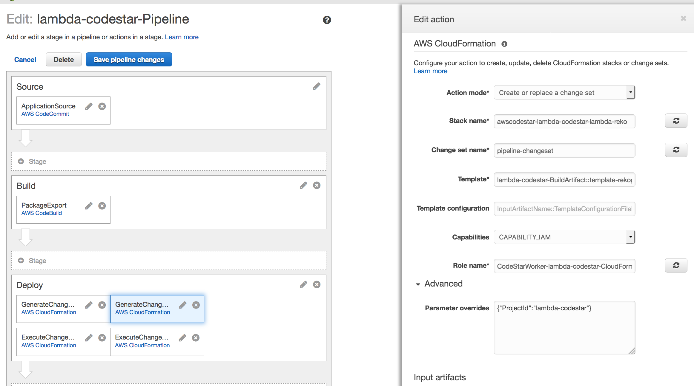

##### 4. Change a policy of CodePipeline
Add a new CloudFormation stack as a target resource. 

```
"Resource": [
    "arn:aws:iam::550622896891:role/CodeStarWorker-lambda-codestar-CloudFormation",
    "arn:aws:cloudformation:us-east-1:5506228xxxxx:stack/awscodestar-lambda-codestar-lambda/*",
    "arn:aws:cloudformation:us-east-1:5506228xxxxx:stack/awscodestar-lambda-codestar-lambda-reko/*",
```

##### 5. Deploy a new deployment
- Release change
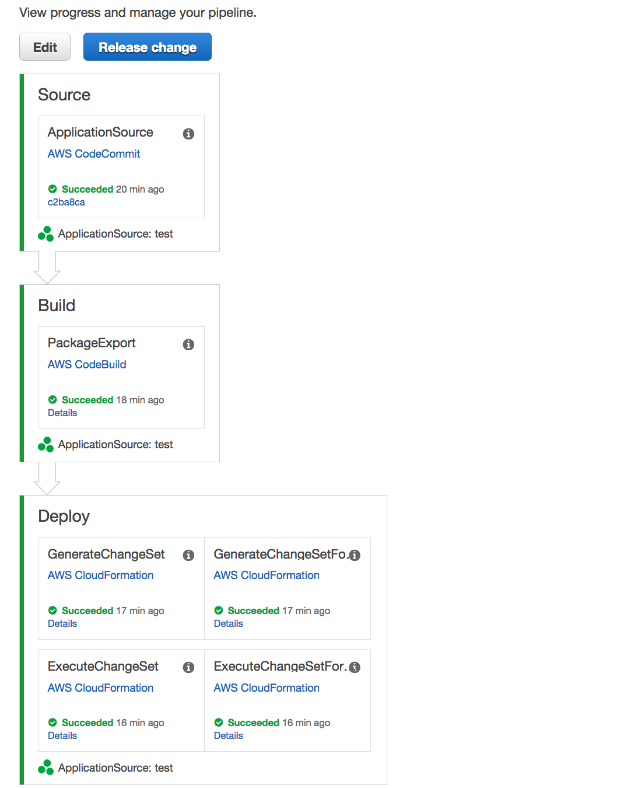


### 4. Change a paratmeter in CodePipeline


- multiple project in eclipse
http://www.avajava.com/tutorials/lessons/how-do-i-create-a-multi-module-project-in-eclipse.html
		
refer : https://stelligent.com/2017/03/09/using-parameter-store-with-aws-codepipeline/

