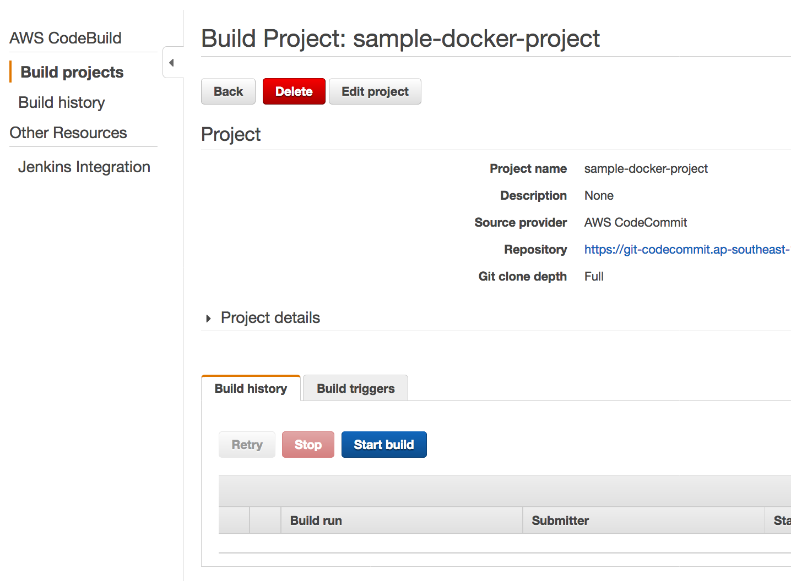
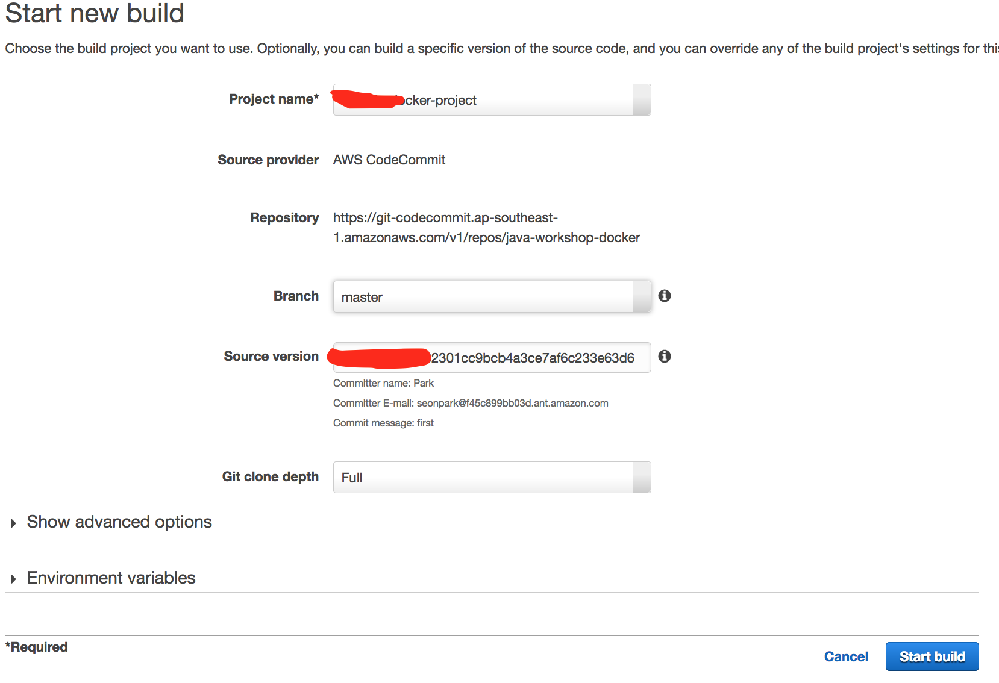

## Module-08-2 Dockerization and CI/CD

In this module, we introduce the fundamental concept of CodeStar and how to build a quick CI/CD pipeline with CodeStar. You will be provided with hands-on on migrating your project to CodeStar project you created and how to build docker environment for your application
- Create a docker for your application and deploy through CI/CD
- Create a CodeBuilder for Java compilation and Dockerization
- Push docker image to ECR
- Getting a docker from ECR and check it's availablity on local mahcine
- Complete a CICD for dockerization and deployment to ECS


### 1. Create a docker for this application.


#### 1.1 Create your first local docker 

refer : 
https://docs.aws.amazon.com/AmazonECS/latest/developerguide/docker-basics.html#docker-basics-create-image

- You need to install docker in your local server

##### 1. Run your first docker application

	1. Check a Dockerfile

```
FROM openjdk:8-jdk-alpine
VOLUME /tmp
ARG JAR_FILE
COPY ${JAR_FILE} app.jar
ENTRYPOINT ["java","-Djava.security.egd=file:/dev/./urandom","-jar","/app.jar"]
```
	2. Create a docker image
	
```	
	docker build -t hello-world . --build-arg JAR_FILE="./target/<YOUR_ARTIFACT_FILE>"
```

	3. Run docker in your local machine
	
```
	docker run -p 8080:8080 -it hello-world bash
```

	4. Check the application in your console
	
	5. Change a host port for 80
	
```
	docker run -p 80:8080 -it hello-world bash
```

##### 2. More commands for docker

	1. run docker as a daemon
```
	docker run -d -p 80:8080 --name=test-1 hello-world --build-arg JAR_FILE="./target/<YOUR_ARTIFACT_FILE>"
	
	docker build -t hello-world . --build-arg JAR_FILE="<YOUR_ARTIFACT_FILE>"
	
```
	2. Check running docker and stop it

```
	docker ps

	docker stop <CONTAINER ID>
```

	3. Remove all container

```
	docker stop $(docker ps -a -q)
	docker rm $(docker ps -a -q)
```

#### 1.2 Create a ECR repository

	1. Run a following AWS CLI command

```
	aws ecr create-repository --repository-name java-workshop	
	
```
	2. Check response and save a repository ARN

```
{
    "repository": {
        "registryId": "550622896891", 
        "repositoryName": "java-workshop	", 
        "repositoryArn": "arn:aws:ecr:ap-southeast-1:<account id>:repository/java-workshop	", 
        "createdAt": 1516947869.0, 
        "repositoryUri": "<account id>.dkr.ecr.ap-southeast-1.amazonaws.com/java-workshop	"
    }
}

```

#### 1.3 Configure CodeCommit and Git credentials

##### 1. Create a CodeCommit repository
 
 Refer : 
  https://docs.aws.amazon.com/codecommit/latest/userguide/setting-up.html#setting-up-standard
 
	1. create a repository in CodeCommit

```
 aws codecommit create-repository --repository-name java-workshop-docker --region <YOUR REGION>    
```

	2. Download your CodeCommeit credentials from IAM
	
	3. Create a credentials

```
git config --global credential.helper '!aws codecommit credential-helper $@'
git config --global credential.UseHttpPath true

      
```

##### 2. if you have any problems on pushing (MacOS only)

**Easy solution !!**
- **Delete all codecommit keychains**

  

refer : https://docs.aws.amazon.com/codecommit/latest/userguide/setting-up-https-unixes.html

If you are using macOS, use HTTPS to connect to an AWS CodeCommit repository. After you connect to an AWS CodeCommit repository with HTTPS for the first time, subsequent access will fail after about fifteen minutes. The default Git version on macOS uses the Keychain Access utility to store credentials. For security measures, the password generated for access to your AWS CodeCommit repository is temporary, so the credentials stored in the keychain will stop working after about 15 minutes. To prevent these expired credentials from being used, you must either:


    1. Install a version of Git that does not use the keychain by default.
    2. Configure the Keychain Access utility to not provide credentials for AWS CodeCommit repositories.
    3. Open the Keychain Access utility. (You can use Finder to locate it.)
    4. Search for git-codecommit.us-east-2.amazonaws.com. Highlight the row, open the context menu or right-click it, and then choose Get Info.
    5. Choose the Access Control tab.
    6. In Confirm before allowing access, choose git-credential-osxkeychain, and then choose the minus sign to remove it from the list.
    7. Note
    	After removing git-credential-osxkeychain from the list, you will see a pop-up dialog whenever you run a Git command. Choose Deny to continue. If you find the pop-ups too disruptive, here are some alternate options:
        Connect to AWS CodeCommit using SSH instead of HTTPS. For more information, see For SSH Connections on Linux, macOS, or Unix.
        In the Keychain Access utility, on the Access Control tab for git-codecommit.us-east-2.amazonaws.com, choose the Allow all applications to access this item (access to this item is not restricted) option. This will prevent the pop-ups, but the credentials will eventually expire (on average, this takes about 15 minutes) and you will see a 403 error message. When this happens, you must delete the keychain item in order to restore functionality.


#### 1.4 Create a build project

refer : https://docs.aws.amazon.com/codebuild/latest/userguide/sample-docker.html
	
##### 1. Change create-builder.json

	1. Change the values accoriding to your environments
	2. CodeCommit URL, region-ID, account-ID,Amazon-ECR-repo-name and role-name ARN

```
{
  "name": "sample-docker-project",
  "source": {
    "type": "CODECOMMIT",
    "location": "<YOUR code commit URL>"
  },
  "artifacts": {
    "type": "NO_ARTIFACTS"
  },
  "environment": {
    "type": "LINUX_CONTAINER",
    "image": "aws/codebuild/docker:17.09.0",
    "computeType": "BUILD_GENERAL1_SMALL",
    "environmentVariables": [
      {
        "name": "AWS_DEFAULT_REGION",
        "value": "region-ID"
      },
      {
        "name": "AWS_ACCOUNT_ID",
        "value": "account-ID"
      },
      {
        "name": "IMAGE_REPO_NAME",
        "value": "Amazon-ECR-repo-name"
      },
      {
        "name": "IMAGE_TAG",
        "value": "latest"
      }
    ]
  },
  "serviceRole": "arn:aws:iam::account-ID:role/role-name"
}

```

##### 3. Create a builder project

Use create-builder.json 

```
aws codebuild create-project --cli-input-json file://create-java-builder.json

aws codebuild create-project --cli-input-json file://create-dock-builder.json


aws ecr get-login --no-include-email --region ap-southeast-1 | sh
      
docker build -t java-workshop:latest . --build-arg JAR_FILE="gs-spring-boot-docker-0.1.0.jar"
docker tag java-workshop:latest 550622896891.dkr.ecr.ap-southeast-1.amazonaws.com/java-workshop:latest
docker push 550622896891.dkr.ecr.ap-southeast-1.amazonaws.com/java-workshop:latest 

```

##### 4. Commit a source to new CodeCommit repository

	1. Change directory to <YOUR WORKSPACE>
	2. Clone your codecommit repo


```
cd <your workspace>

git clone <REPO>

cd java-workshop-docker

cp -R <YOUR PROJECT>/* .


```


##### 5. Start Build

	1. In your Codebuild Console, click a Start Build Button



	2. Select master branch


		

##### 6. Check Your Roles for CoudeBuild

Check your build result and if your role dosen' have enough privilege then add more access privilege on access policy.

	1. Give a full CloudWatch Write privilege
	2. Give a full ECR privilege


<hr>


### Reference : Change a paratmeter in CodePipeline


- multiple project in eclipse
http://www.avajava.com/tutorials/lessons/how-do-i-create-a-multi-module-project-in-eclipse.html
		
refer : https://stelligent.com/2017/03/09/using-parameter-store-with-aws-codepipeline/


<hr>


