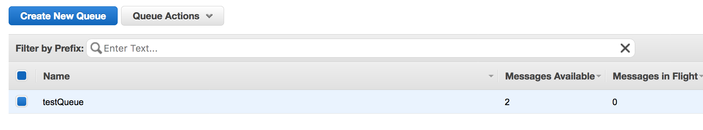

## Module-10 Batch Processing for 

### 1. Cloud9 IDE

reference : https://github.com/awsdocs/aws-doc-sdk-examples/tree/master/java

If you want to use above codes then download codes
	1. change root directory and download java exampless

```
cd ~/environment
git clone https://github.com/awsdocs/aws-doc-sdk-examples.git

```
	
	2. Configure your credentials

```
aws configure
### specify ACESS/SECRET in your local instance
```

##### 1. Run module-10-sqs
	1. Open a SendReceiveMessage.java
	2. Comment out below code

```
// receive messages from the queue
//        List<Message> messages = sqs.receiveMessage(queueUrl).getMessages();
//
//        System.out.println("Message size = " + messages.size());
//        
//        // delete messages from the queue
//        for (Message m : messages) {
//            System.out.println("Messages = " + m.getBody());
//            sqs.deleteMessage(queueUrl, m.getReceiptHandle());
//        }
```

	3. Run the code and check your SQS console 
	


	4. Uncomment above code and comment out below codes
	
```
//        SendMessageRequest send_msg_request = new SendMessageRequest()
//                .withQueueUrl(queueUrl)
//                .withMessageBody("hello world")
//                .withDelaySeconds(5);
//        sqs.sendMessage(send_msg_request);
//
//
//        // Send multiple messages to the queue
//        SendMessageBatchRequest send_batch_request = new SendMessageBatchRequest()
//                .withQueueUrl(queueUrl)
//                .withEntries(
//                        new SendMessageBatchRequestEntry(
//                                "msg_1", "Hello from message 1"),
//                        new SendMessageBatchRequestEntry(
//                                "msg_2", "Hello from message 2")
//                                .withDelaySeconds(10));
//        sqs.sendMessageBatch(send_batch_request);
```

	4. Re-run the code and check SQS console	
	
	5. Open SendRecieveMaxMessage.java
	6. Run the codes in same way above

```
ReceiveMessageRequest receiveMessageRequest = new ReceiveMessageRequest(queueUrl);
receiveMessageRequest.setMaxNumberOfMessages(10);
List<Message> messages = sqs.receiveMessage(receiveMessageRequest).getMessages();

```

	7. Check the meaning of .withDelaySeconds(10)
https://docs.aws.amazon.com/AWSSimpleQueueService/latest/SQSDeveloperGuide/sqs-delay-queues.html
	
	
	

