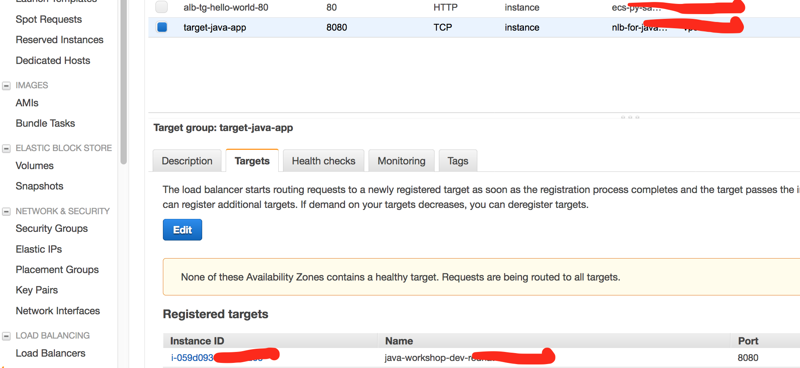
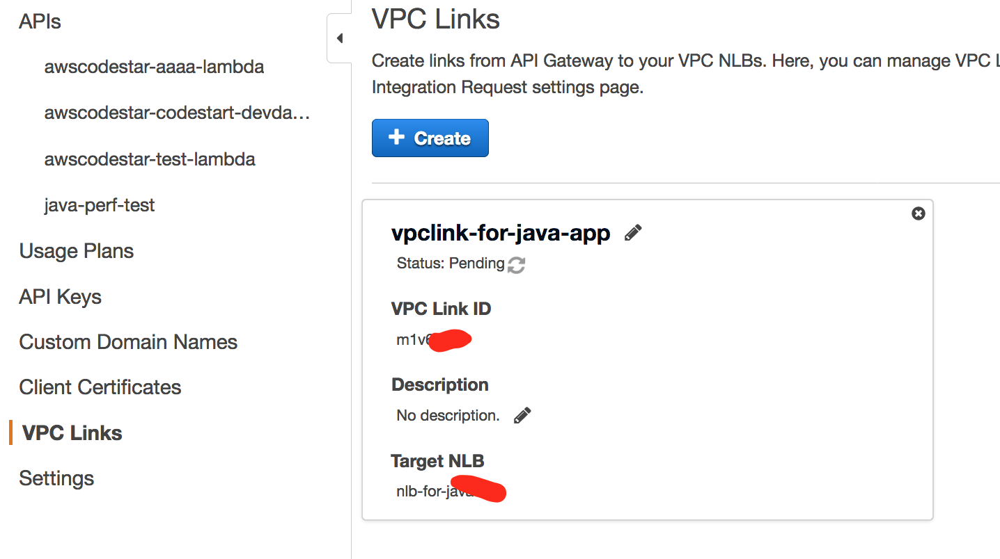
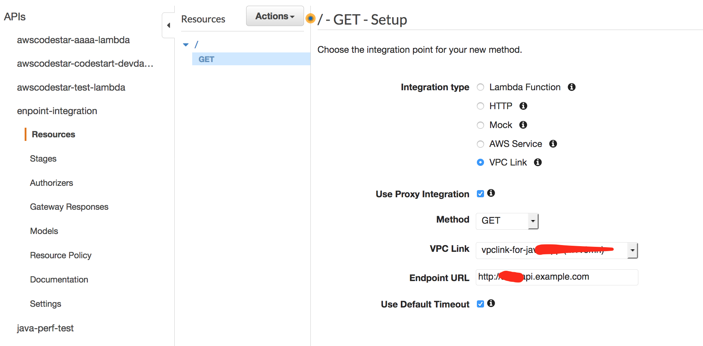

## Module-12 API Gateway

### 1. API G/W for private endpiont
- There are 2 approaches, 
- (1) API GW client side termination.
refer:
https://docs.aws.amazon.com/apigateway/latest/developerguide/getting-started-client-side-ssl-authentication.html

- (2) API GW endpint integrations
refer:
https://aws.amazon.com/about-aws/whats-new/2017/11/amazon-api-gateway-supports-endpoint-integrations-with-private-vpcs/


- Recommend 2 as an integration of API GW and back end resources

#### 1.1 To create a network load balancer for private integration using the API Gateway console

	1. Sign in to the Amazon EC2 console at https://console.aws.amazon.com/ec2/ and choose a region; for example, us-east-1, on the navigation bar. 
	2. Set up a web server on an Amazon EC2 instance.(use a linux dev in us-east-1 or ap-southeast-1)
	3. Configure Network Load Balancer with specify target group. (create it as "internal" to hide nlb endpoint)
	https://docs.aws.amazon.com/elasticloadbalancing/latest/network/network-load-balancer-getting-started.html
	
	4. Must register your instance in target goup created in above step.
	

	
	5. To create an API with private integration using the API Gateway console
refer : https://docs.aws.amazon.com/apigateway/latest/developerguide/getting-started-with-private-integration.html
		


	6. Create a GET method with VPC link integration
	


#### 1.2 Create API resource and proxy+


#### 1.3 Test a API

```
curl <API invoke URL>
curl '<API invoke URL>/workshop/users/all'
```

<hr>


### 2. API G/W Custom Authorizer (optional)

openid provider: https://docs.aws.amazon.com/cognito/latest/developerguide/open-id.html


<hr>

### 3. API G/W cognito user pools.


	